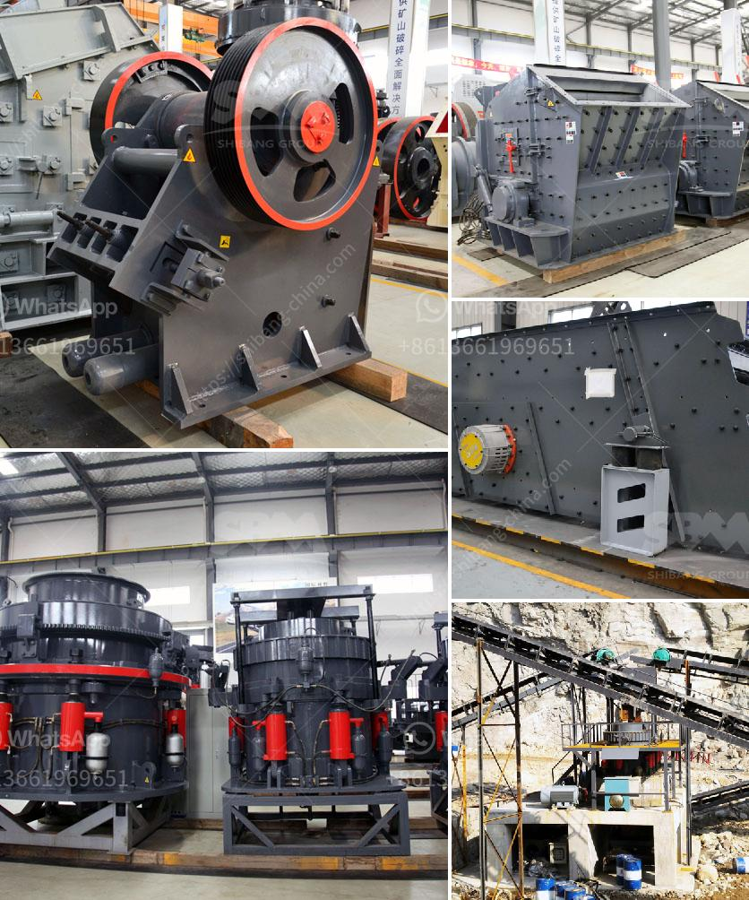

<h3>construction and crusher machinery crusher machinery</h3>
Construction and crusher machinery have revolutionized the modern-day building and construction industry. This machinery is designed to reduce large rocks into smaller rocks, gravel, sand, or rock dust. This type of machinery is often used in the manufacturing of cement, construction materials, and various other applications.

Crusher machinery plays a vital role in enhancing the efficiency and productivity of construction projects. It allows construction professionals to break down large rocks or stones into smaller, more manageable pieces, which can then be used for various construction purposes. These machines are widely used in mining, quarrying, and recycling applications.

The primary goal of crusher machinery is to reduce the size of the extracted material. This is achieved by applying mechanical force through the use of a crushing mechanism. The machine operates by exerting pressure on the material, which causes it to break into smaller pieces. The size reduction process is crucial for the construction industry as it enables materials to be transported easily and efficiently.

One of the key benefits of crusher machinery is its versatility. These machines can handle a wide range of materials, including rocks, ores, minerals, and aggregates. They can also be used to break down concrete, asphalt, and other construction waste materials. This versatility offers construction professionals a cost-effective and time-efficient solution for their various construction needs.

Moreover, modern crusher machinery comes equipped with advanced features and technologies that enhance its effectiveness and efficiency. For instance, many crushers are designed with hydraulic systems that allow for smooth and precise operation. They also feature adjustable settings, such as closed side settings, which allow for the precise control of the size of the end product.

Another important aspect of crusher machinery is its environmental impact. With the increasing focus on sustainability and responsible construction practices, crusher machinery manufacturers have developed innovative solutions that minimize the environmental footprint of these machines. For example, some crushers are equipped with dust suppression systems or water sprayers to control dust emissions during the crushing process.

In addition to reducing the size of materials, crusher machinery also plays a significant role in recycling applications. Construction waste, such as concrete and asphalt, can be recycled and used as aggregate for new construction projects. Crushers are used to break down the waste into smaller pieces, which can then be reused or repurposed. This not only reduces landfill waste but also conserves natural resources.

In conclusion, crusher machinery is a crucial component of modern construction projects. Its ability to reduce the size of materials and its versatility make it an indispensable tool in the construction industry. With continued advancements in technology and an increasing focus on sustainability, crusher machinery is expected to become even more efficient and environmentally friendly in the future. As the demand for construction materials continues to rise, crusher machinery will continue to play a vital role in meeting these demands and shaping the future of the construction industry.
<h3>Contact us</h3><ul><li><strong>Whatsapp:&nbsp;<a href="https://wa.me/8613661969651">+8613661969651</a></strong></li><li><a href="https://swt.shibang-china.com/?git&amp;zhl&amp;construction and crusher machinery crusher machinery"><strong>Online Service(chat now)</strong></a></li></ul><h3>Related</h3><ul><li><a href='gold mining processing plant in canada.md'>gold mining processing plant in canada</a></li><li><a href='rumus perhitungan kapasitas jaw crusher.md'>rumus perhitungan kapasitas jaw crusher</a></li><li><a href='gypsum production process plant design.md'>gypsum production process plant design</a></li><li><a href='powder making machinery.md'>powder making machinery</a></li><li><a href='second hand mobile crushers and screens south africa.md'>second hand mobile crushers and screens south africa</a></li></ul>