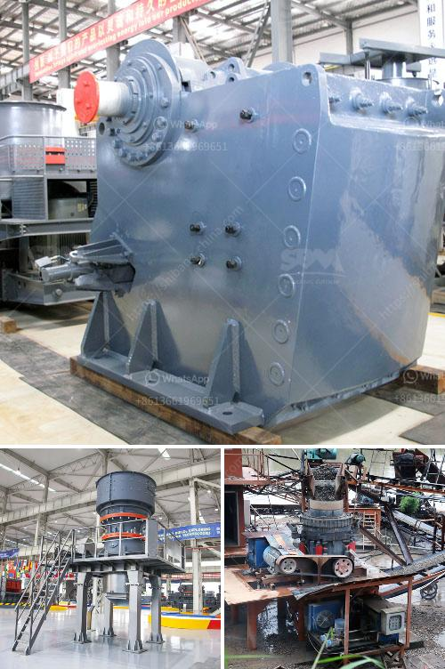

<h3>contact address puzzolana cone crusher</h3>
Puzzolana cone crushers are highly popular for aggregate crushing in both stationary and mobile applications. The crushing chamber can be specially designed to suit the customer requirements apart from standard design. Puzzolana cone crushers are ideal for producing large volumes.

A special gap setting arrangement is provided to give required product size. These crushers are designed to operate in most rugged environment and need less maintenance. Available in 14 sizes, 30" x 20" to 72" x 60" - upto 1000 TPH.

Puzzolana's cone crushers are provided with either grease or oil lubrication for smooth functioning. The design fabrications that Puzzolana cone crushers comprise are choke fed, thus maintaining a consistent feed distribution. The high crushing speeds enabled by their state-of-the-art cavity design produce significantly more cone crusher output than competing designs.

Puzzolana cone crushers feature a unique combination of crusher speed, throw and cavity design. This combination has proved revolutionary, as it combines higher capacity with the best possible product shape. The automation system of Puzzolana cone crushers ensures maximum reliability with optimum production output.

The contact address for Puzzolana cone crushers is conveniently located in the heart of the city. With easy accessibility and a dedicated team of professionals, customers can reach out for any queries or assistance regarding their cone crusher needs.

The contact address also serves as a hub for spare parts availability. Puzzolana understands the criticality of timely availability of spare parts, and thus has established a robust distribution network to ensure smooth operations for their customers. This ensures that any downtime is minimized, and the crusher can be up and running again quickly.

Puzzolana cone crushers are known for their versatility. They can handle a wide range of materials, from limestone to basalt, and from stone to iron ore. Puzzolana cone crushers are ideal for producing high-quality aggregates for road and railway applications.

The cone crushers also come with various safety features such as hydraulic overload protection, chamber clearing system, and automatic setting adjustments to ensure efficient and safe operation. These features, combined with the robust design and construction of Puzzolana cone crushers, make them a reliable choice for any crushing application.

In conclusion, Puzzolana cone crushers are reliable machines with a high crushing capacity. They are well-suited for both stationary and mobile applications, and their contact address ensures easy accessibility for customer queries and spare parts availability. With advanced features and a commitment to customer satisfaction, Puzzolana cone crushers are a preferred choice in the aggregate crushing industry.
<h3>Contact us</h3><ul><li><strong>Whatsapp:&nbsp;<a href="https://wa.me/8613661969651">+8613661969651</a></strong></li><li><a href="https://swt.shibang-china.com/?git&amp;zhl&amp;contact address puzzolana cone crusher"><strong>Online Service(chat now)</strong></a></li></ul><h3>Related</h3><ul><li><a href='stone crusher in inda or parkistan.md'>stone crusher in inda or parkistan</a></li><li><a href='part of hammer mill.md'>part of hammer mill</a></li><li><a href='jaw crusher vs cone crusher.md'>jaw crusher vs cone crusher</a></li><li><a href='hammer mill buy.md'>hammer mill buy</a></li><li><a href='cost of hammer mill.md'>cost of hammer mill</a></li></ul>