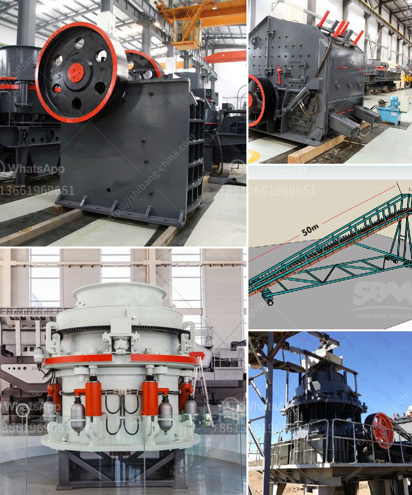

<h3>continuous ball mill capacity 500 hr</h3>
A continuous ball mill is a specialized machine that is used to grind materials such as cement, ores, chemicals, and other similar materials. It offers a wide range of benefits like lower power consumption, higher operational efficiency, and flexible grinding capacities. With a capacity of 500 hr, this equipment is an essential asset for any mining or industrial operation.

The continuous ball mill operates by rotating a cylinder with grinding balls, thereby creating friction and impacting the material being ground. This process helps to reduce particle size, enhance mixing and homogenization, and increase the reaction rate for chemical reactions. As a result, it is widely used in various industries, including cement, mining, and pharmaceuticals.

One of the key advantages of a continuous ball mill is its ability to grind materials continuously, without any interruption. This feature allows for higher productivity as the machine can operate for extended periods, reducing downtime and increasing overall efficiency. Moreover, it eliminates the need for frequent start and stop cycles, ensuring a consistent flow of materials and reducing energy consumption.

Another significant benefit of a continuous ball mill is its high grinding capacity. With a capacity of 500 hr, this equipment can process a substantial amount of material in a short period. This makes it ideal for applications that require large quantities of finely ground material, such as cement production or mineral processing. The high grinding capacity translates into increased production rates and improved profitability for the users.

In addition to its high capacity, the continuous ball mill offers excellent control over the grinding process. Operators can adjust the speed, load, and other parameters to optimize the grinding efficiency and achieve the desired product characteristics. This level of control allows for precise customization of the final product, ensuring consistent quality and meeting specific requirements.

Furthermore, the continuous ball mill is a reliable and robust machine that requires minimal maintenance. Its simple design and sturdy construction make it suitable for heavy-duty operations, minimizing the risk of breakdowns and costly downtime. Additionally, many manufacturers provide comprehensive after-sales support, ensuring that customers can rely on their equipment for extended periods without any difficulties.

To conclude, a continuous ball mill with a capacity of 500 hr is an essential tool for grinding various materials in industries such as cement, mining, and pharmaceuticals. Its ability to operate continuously, high grinding capacity, and precise control over the grinding process make it a valuable asset for any industrial operation. Furthermore, its reliability and low maintenance requirements ensure long-term productivity and profitability. Whether it is used for cement production, mineral processing, or chemical reactions, the continuous ball mill proves to be an indispensable machine that enhances efficiency and increases the bottom line.
<h3>Contact us</h3><ul><li><strong>Whatsapp:&nbsp;<a href="https://wa.me/8613661969651">+8613661969651</a></strong></li><li><a href="https://swt.shibang-china.com/?git&amp;zhl&amp;continuous ball mill capacity 500 hr"><strong>Online Service(chat now)</strong></a></li></ul><h3>Related</h3><ul><li><a href='material composition for coal screen.md'>material composition for coal screen</a></li><li><a href='vibrator machine for concrete.md'>vibrator machine for concrete</a></li><li><a href='gold mining equipment for sale at malaysia.md'>gold mining equipment for sale at malaysia</a></li><li><a href='crushing machines for ceramic.md'>crushing machines for ceramic</a></li><li><a href='hammer mill mining.md'>hammer mill mining</a></li></ul>