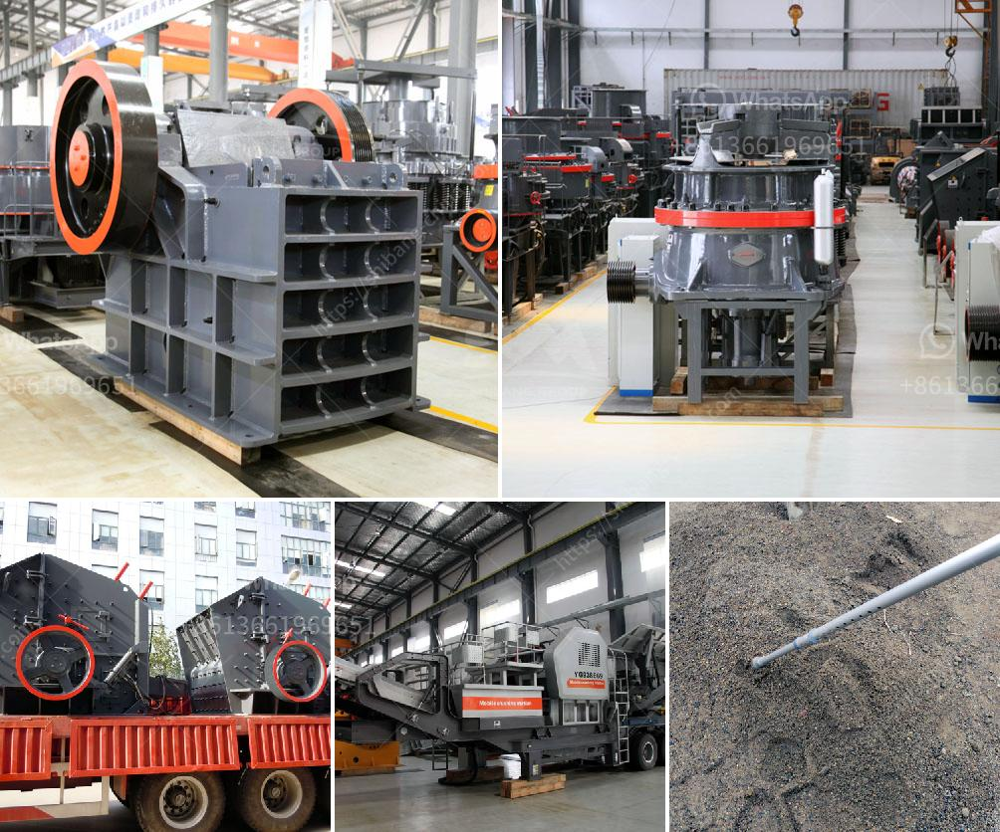

<h3>control plan for ball mill manufacturing</h3>
The grinding process of ball mill is a mechanical reduction in size of crushable material. Grinding can be carried out in either wet or dry conditions, depending on the mill configuration. In a ball mill, grinding occurs when a particle is crushed between two pieces of grinding media. Grinding efficiency therefore depends on the size of the grinding media. The ball mill can operate in an open or closed circuit, and has a corrugated lining in the grinding compartment for added effectiveness.

To ensure the efficient operation of the ball mill, manufacturers should develop a control plan that outlines the steps to follow during the process. The control plan should address various aspects of the manufacturing process, including the selection of appropriate materials, equipment setup, and operational parameters.

One crucial element in the control plan for ball mill manufacturing is measuring and controlling the particle size distribution during the grinding process. This can be achieved by using a laser particle size analyzer to monitor the size distribution of the grinding media. By continuously measuring the size distribution, manufacturers can adjust the operational parameters (e.g., grinding time, rotation speed) to achieve the desired particle size distribution and optimize grinding efficiency.

Another important aspect of the control plan is monitoring the temperature inside the ball mill. Excessive heat can have a detrimental effect on the grinding process, leading to reduced efficiency and increased wear and tear on the equipment. Manufacturers should install temperature sensors at various points inside the mill to monitor and control the temperature. Automated systems can be used to regulate the flow of cooling water or adjust the speed of the mill to maintain the desired temperature range.

Proper maintenance and regular inspection of the ball mill are also essential in ensuring optimal performance. Manufacturers should establish a maintenance schedule that includes regular cleaning, lubrication, and inspection of critical components such as the liners, trunnion bearings, and gears. Any signs of wear or damage should be promptly addressed to avoid further complications and maintain efficient operation.

Additionally, safety precautions should be integrated into the control plan to ensure the well-being of operators and minimize the risk of accidents. This can include providing training on proper operating procedures, implementing lockout/tagout procedures, and promoting good housekeeping practices in the manufacturing area.

In conclusion, developing a control plan for ball mill manufacturing is crucial to achieve efficient and reliable operation. The plan should include measures to monitor and control the particle size distribution, temperature, and maintenance of the mill. By following this plan, manufacturers can optimize the grinding process, enhance product quality, and ensure the safety of operators.
<h3>Contact us</h3><ul><li><strong>Whatsapp:&nbsp;<a href="https://wa.me/8613661969651">+8613661969651</a></strong></li><li><a href="https://swt.shibang-china.com/?git&amp;zhl&amp;control plan for ball mill manufacturing"><strong>Online Service(chat now)</strong></a></li></ul><h3>Related</h3><ul><li><a href='quartz grinding ball mill.md'>quartz grinding ball mill</a></li><li><a href='crusher suppliers in kenya.md'>crusher suppliers in kenya</a></li><li><a href='crusher manufacturer in china.md'>crusher manufacturer in china</a></li><li><a href='price of zenith stone crusher.md'>price of zenith stone crusher</a></li><li><a href='stone crusher trading company.md'>stone crusher trading company</a></li></ul>