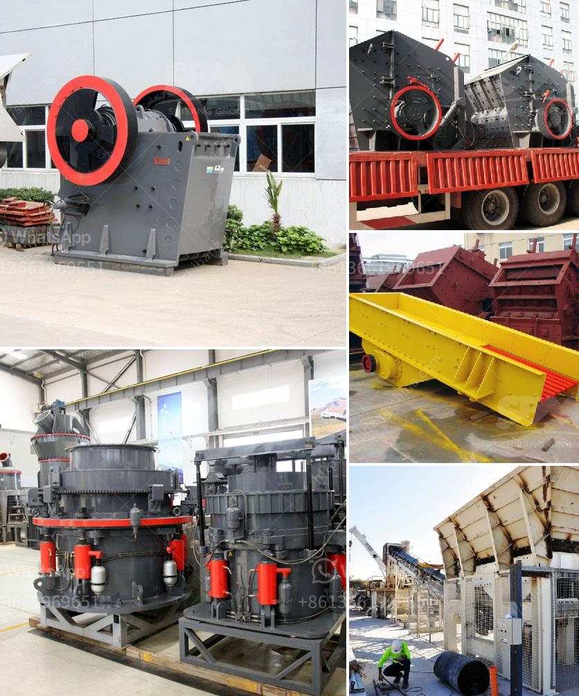

<h3>conventional stone crushers in peru</h3>
Stone crushers have played a pivotal role in the history of Peru, as they have been used extensively for a variety of applications. In earlier years, the stone crusher machines were straightforward and rudimentary, relying on brute force to crush stones into desired sizes. However, with technological advancements, modern stone crushers have evolved into highly efficient and sophisticated machines. This article sheds light on the conventional stone crushers that were commonly used in Peru and their significance in the country's development.

Conventional stone crushers utilized basic mechanisms such as the lever, cam, and pulley system to achieve stone crushing. They used powerful force to break large-sized stones into smaller pieces along with repetitive motion that allowed the machine to efficiently process even the toughest rocks. These machines were typically operated manually, requiring physical exertion and persistence to yield the desired results.

One of the most commonly used types of stone crushers in Peru was the jaw crusher. This machine, as the name suggests, works by pressing the materials against a fixed jaw plate, which eventually breaks them apart. Jaw crushers were durable and able to handle a wide range of materials, making them ideal for processing stone and gravel for construction projects.

Another widely used stone crusher was the cone crusher. This machine features a cone-shaped crushing chamber that allows stones to be crushed more effectively and efficiently. Cone crushers have been extensively used in the mining industry and continue to play a crucial role in Peru's mining operations today. They are especially effective in crushing hard and abrasive rocks.

Impact crushers were also utilized for stone crushing in Peru. These crushers used the principles of impact and attrition to crush various materials, including rocks. They were particularly suitable for crushing brittle materials due to their ability to apply high levels of force in a short period. Impact crushers were commonly used in industries such as cement production and mining.

Conventional stone crushers played a vital role in Peru's construction and mining sectors, providing the necessary materials for infrastructure development and economic growth. They were integral in the production of aggregates used in road construction, concrete manufacturing, and railway ballast.

However, with technological advancements, conventional stone crushers are gradually being replaced by more advanced and efficient machines. Modern crushers offer enhanced productivity, reduced environmental impact, and improved operator safety. These advancements have been instrumental in boosting Peru's stone crushing industry, ensuring higher output capacity and quality.

In conclusion, conventional stone crushers have significantly contributed to Peru's development by providing the necessary materials for construction and infrastructure projects. These machines relied on basic mechanical principles to efficiently crush stones, with jaw crushers, cone crushers, and impact crushers being the commonly used variants. While modern advancements have led to the development of more sophisticated stone crushers, the legacy of the conventional machinery remains essential in understanding the evolution of Peru's stone crushing industry.
<h3>Contact us</h3><ul><li><strong>Whatsapp:&nbsp;<a href="https://wa.me/8613661969651">+8613661969651</a></strong></li><li><a href="https://swt.shibang-china.com/?git&amp;zhl&amp;conventional stone crushers in peru"><strong>Online Service(chat now)</strong></a></li></ul><h3>Related</h3><ul><li><a href='dry grinding rod mill.md'>dry grinding rod mill</a></li><li><a href='prices for cement processing machines.md'>prices for cement processing machines</a></li><li><a href='limestone ball mill machine.md'>limestone ball mill machine</a></li><li><a href='work principle of a hammer mill.md'>work principle of a hammer mill</a></li><li><a href='type of ball mill.md'>type of ball mill</a></li></ul>