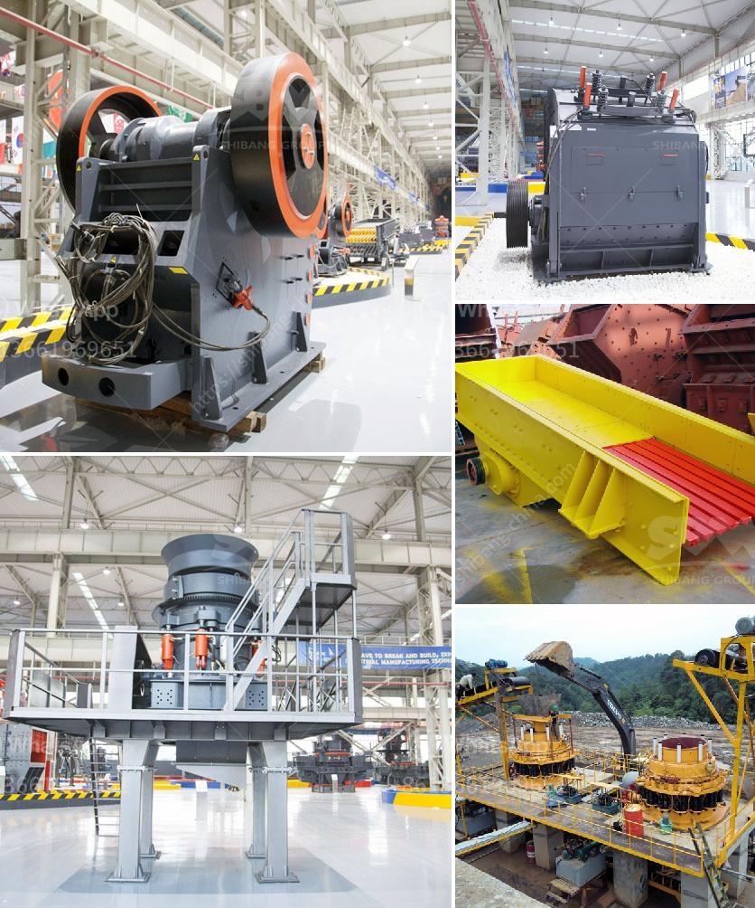

<h3>conveyor belt equipment for mining south africa</h3>
South Africa is a renowned hub for mining operations due to its rich mineral resources. It has been a leading producer of gold, diamond, platinum, chrome, and coal, among other minerals. To efficiently extract these minerals, conveyor belt equipment plays a pivotal role in the mining industry. Conveyor belts enable the transportation of bulk materials, reducing labor-intensive processes and enhancing productivity.

The mining industry extensively relies on conveyor belts for various operations, including transporting raw materials, moving extracted minerals to processing plants, and ensuring efficient distribution. Conveyor belt systems used in the mining sector are designed to withstand robust and harsh conditions, such as extreme temperatures, heavy loads, and high-speed operations. They are built to endure the demanding environments of mines, ensuring optimal performance and longevity.

Conveyor belt equipment for mining in South Africa is characterized by advanced technology and high-quality materials, making it suitable for the industry's unique needs. The equipment is built to withstand the demanding mining environment, ensuring uninterrupted operations, increased productivity, and enhanced safety for workers.

One of the key features of conveyor belt equipment for mining in South Africa is the ability to handle various types of materials. These materials may include coal, iron ore, gold, diamond, copper, and limestone, among others. The versatility of conveyor belts makes them suitable for different mining applications, enabling efficient transportation and handling of materials throughout the mining process.

In addition to material handling, conveyor belt equipment in the mining industry assists in stockpiling and stacking of minerals. Stockpiling ensures a steady supply of minerals while reducing manual labor. Stacking minerals on conveyor belts allows for efficient storage and subsequent retrieval, minimizing the risk of damage and improving the overall management of stockpiles.

Conveyor belts are essential for the smooth operation of mining operations in South Africa. They are designed with safety in mind, incorporating features such as emergency stop buttons, speed monitoring systems, and fire-resistant materials. These safety measures aim to protect workers and prevent accidents, ensuring a secure working environment.

Maintenance and servicing of conveyor belt equipment are crucial to ensure reliable and efficient operations. Regular inspections, lubrication, and timely repairs help prevent breakdowns and minimize downtime. Mining companies in South Africa prioritize the maintenance of conveyor belt equipment to ensure uninterrupted operations and maximize productivity.

With the growing demand for mineral resources globally, conveyor belt equipment for mining in South Africa continues to evolve and adapt to meet the industry's changing needs. Advanced technologies, such as automation and remote monitoring systems, are being integrated into conveyor belt equipment, enhancing efficiency and reducing operational costs.

In conclusion, conveyor belt equipment for mining in South Africa is vital for the efficient extraction, transportation, and distribution of mineral resources. These durable and versatile systems enable mining companies to streamline their operations, reduce manual labor, and improve safety. With ongoing technological advancements, conveyor belt equipment will continue to play a crucial role in the growth and success of the mining industry in South Africa.
<h3>Contact us</h3><ul><li><strong>Whatsapp:&nbsp;<a href="https://wa.me/8613661969651">+8613661969651</a></strong></li><li><a href="https://swt.shibang-china.com/?git&amp;zhl&amp;conveyor belt equipment for mining south africa"><strong>Online Service(chat now)</strong></a></li></ul><h3>Related</h3><ul><li><a href='sand hand bentonite grinding mill.md'>sand hand bentonite grinding mill</a></li><li><a href='mining equipment companies in nigeria.md'>mining equipment companies in nigeria</a></li><li><a href='old hammer mill for sale.md'>old hammer mill for sale</a></li><li><a href='mtm trapezium grinder mill.md'>mtm trapezium grinder mill</a></li><li><a href='dry process of cement.md'>dry process of cement</a></li></ul>