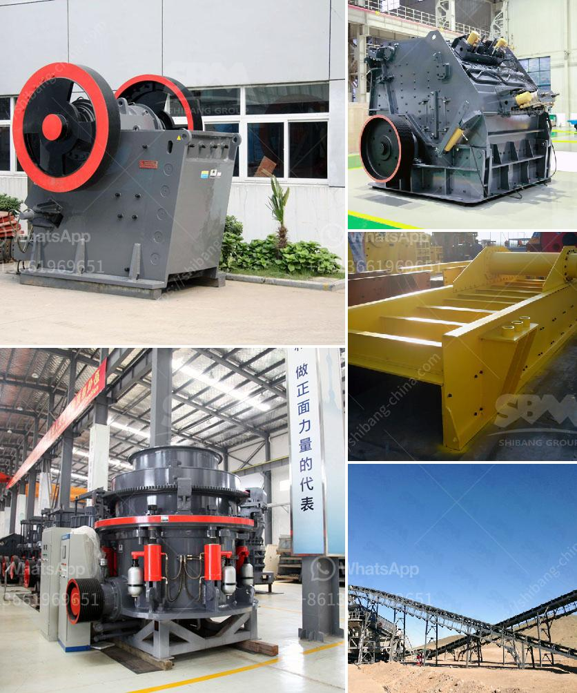

<h3>conveyor belt for fly ash</h3>
A conveyor belt is a vital component in the transportation of fly ash, a fine powder produced from the combustion of pulverized coal in thermal power plants. The fly ash particles are collected from the power plant's exhaust gases and are stored in large silos. These silos are then connected to a conveyor system that transports the ash to various points within the power plant or to external locations for disposal or utilization purposes.

One of the primary advantages of using a conveyor belt for fly ash transportation is its efficiency. The conveyor system can handle large volumes of fly ash, ensuring a continuous and smooth flow of material. This eliminates the requirement for manual labor and other forms of transportation, thus reducing the overall operating costs for power plants.

Conveyor belts designed for fly ash are constructed with durable materials to withstand the abrasive nature of the powder. The belt is made of rubber, PVC, or other resistant materials that can effectively carry the weight of the ash particles. The belt is supported by rollers and is driven by a motorized pulley, ensuring a steady movement of the ash along its intended path.

Fly ash can be conveyed over long distances using a conveyor belt system. This is particularly beneficial when the power plant and the location for ash disposal are far apart. The conveyor belt can be customized to suit the specific requirements of the power plant, including the length, elevation, and inclination angle. The ash can be transported vertically or horizontally, depending on the plant's layout and the available space.

Another advantage of using a conveyor belt for fly ash is its ability to prevent environmental pollution. Fly ash is a hazardous material and needs to be transported and handled with care. Using a conveyor belt eliminates the risk of spillage or leakage, ensuring that the ash is contained throughout the transportation process. This reduces the potential for contamination of surrounding areas, protecting the environment and the health of nearby communities.

Conveyor belts also facilitate the utilization of fly ash in various applications. Fly ash has been widely recognized as a valuable material for use in construction, as it can enhance the strength and durability of concrete. By using a conveyor belt, power plants can transport fly ash to concrete production facilities, where it can be mixed with cement and other materials to create high-quality concrete products. This promotes the sustainable use of fly ash and reduces the reliance on traditional raw materials.

In conclusion, a conveyor belt is an essential tool for the transportation of fly ash in thermal power plants. Its efficiency, durability, and environmental benefits make it an ideal choice for handling large volumes of ash. By utilizing a conveyor belt system, power plants can streamline their operations, reduce costs, and promote the sustainable utilization of fly ash. Thus, conveyor belts play a crucial role in the efficient management of fly ash in the power generation industry.
<h3>Contact us</h3><ul><li><strong>Whatsapp:&nbsp;<a href="https://wa.me/8613661969651">+8613661969651</a></strong></li><li><a href="https://swt.shibang-china.com/?git&amp;zhl&amp;conveyor belt for fly ash"><strong>Online Service(chat now)</strong></a></li></ul><h3>Related</h3><ul><li><a href='harga pe jc jaw crusher dan harga.md'>harga pe jc jaw crusher dan harga</a></li><li><a href='used stone crushers for ballast sale.md'>used stone crushers for ballast sale</a></li><li><a href='ball mill to crusher carbon charcoal.md'>ball mill to crusher carbon charcoal</a></li><li><a href='used stone crusher mini plant india.md'>used stone crusher mini plant india</a></li><li><a href='crushing plants south africa.md'>crushing plants south africa</a></li></ul>