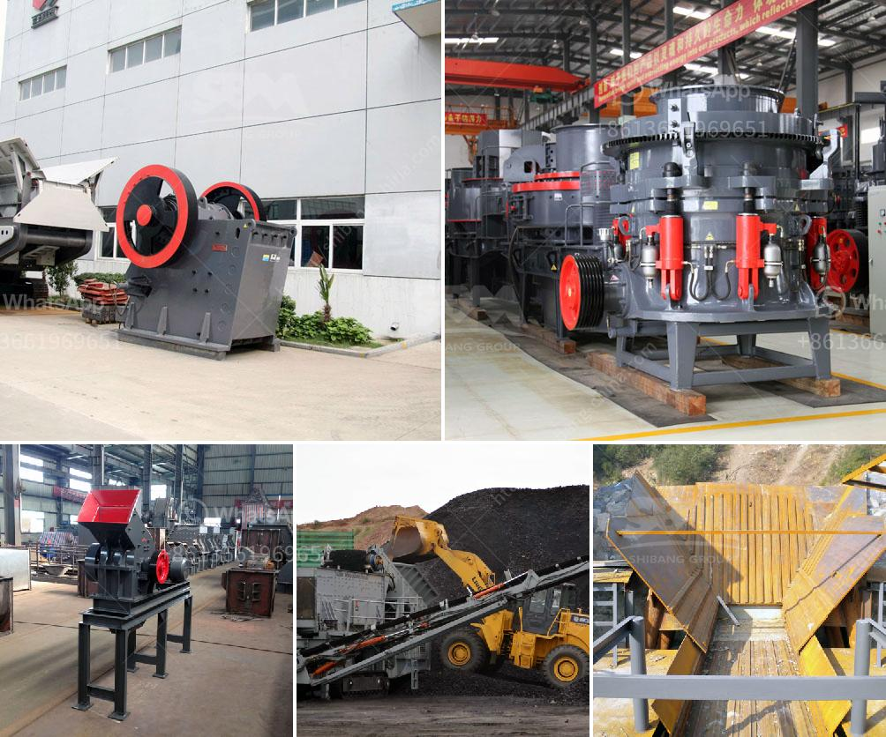

<h3>conveyor belt hangzhou</h3>
Located in the vibrant city of Hangzhou, Conveyor Belt Hangzhou is a leading supplier and manufacturer of high-quality conveyor belts. With a commitment to innovation and excellence, this company has established itself as a trusted name in the industry.

One of the key factors that sets Conveyor Belt Hangzhou apart is their dedication to producing premium-grade conveyor belts. These belts are made from durable materials, ensuring their longevity and reliability. Whether it's for industrial, agricultural, or commercial use, Conveyor Belt Hangzhou offers a wide range of options to meet the diverse needs of their customers.

Furthermore, Conveyor Belt Hangzhou understands the importance of customization in today's market. They provide tailored solutions based on the specific requirements of their clients, guaranteeing an optimal fit for each individual application. This level of personalization ensures maximum productivity and efficiency for businesses of all sizes.

In addition to their exceptional products, Conveyor Belt Hangzhou is known for its exceptional customer service. Their knowledgeable and friendly team is always ready to assist customers with any inquiries, providing expert advice and guidance. With a focus on customer satisfaction, they strive to build long-term relationships based on trust and reliability.

Moreover, Conveyor Belt Hangzhou prioritizes sustainability in their operations. They are committed to reducing their environmental impact by using eco-friendly materials and manufacturing processes. By doing so, they not only contribute to a greener future but also provide customers with environmentally responsible solutions.

Overall, Conveyor Belt Hangzhou is a company that stands out for its commitment to quality, customization, customer service, and sustainability. Whether you're in need of conveyor belts for heavy industries, food processing facilities, or logistics centers, this company offers a wide range of options to meet your specific requirements. With Conveyor Belt Hangzhou, you can be confident in the reliability, durability, and efficiency of their products.
<h3>Contact us</h3><ul><li><strong>Whatsapp:&nbsp;<a href="https://wa.me/8613661969651">+8613661969651</a></strong></li><li><a href="https://swt.shibang-china.com/?git&amp;zhl&amp;conveyor belt hangzhou"><strong>Online Service(chat now)</strong></a></li></ul><h3>Related</h3><ul><li><a href='vertical raw mill industry.md'>vertical raw mill industry</a></li><li><a href='low cost jaw crusher price.md'>low cost jaw crusher price</a></li><li><a href='bentonite clay crusher for sale.md'>bentonite clay crusher for sale</a></li><li><a href='rock crusher machine price in india.md'>rock crusher machine price in india</a></li><li><a href='marble grinding mills machine.md'>marble grinding mills machine</a></li></ul>