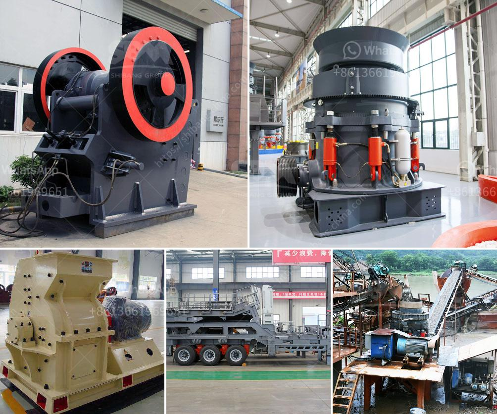

<h3>conveyor belt kazakhstan</h3>
Kazakhstan, a country known for its rich natural resources and vast open spaces, is quickly emerging as a prominent player in the global industrial market. Its rapid industrialization is fueled by its commitment to investing in innovative technologies that improve efficiency and streamline production processes. One such technological marvel that Kazakhstan has embraced with open arms is the conveyor belt system.

A conveyor belt is a continuous loop made of strong materials, such as rubber or fabric, that enables the seamless movement of goods or materials from one location to another. This mechanized system has proven to be a game-changer for various industries, including mining, manufacturing, agriculture, and logistics. Kazakhstan's decision to integrate conveyor belts into its industries has been instrumental in boosting productivity, reducing costs, and ensuring worker safety. 

In the mining sector, conveyor belts have transformed the way raw materials are extracted and transported. In Kazakhstan, where mining plays a vital role in the economy, conveyor belt systems have enabled the efficient movement of minerals such as coal, copper, and uranium. By automating the transportation process, mining companies can significantly increase their output, leading to heightened profitability and improved efficiency.

Moreover, conveyor belts have revolutionized the manufacturing industry in Kazakhstan. The ability to automate the movement of goods along assembly lines has not only minimized labor costs but also reduced the risk of human error. In a highly competitive market, manufacturers in Kazakhstan now have a significant advantage by being able to produce goods quickly and consistently, meeting the demands of both domestic and international markets.

The agricultural sector is also benefiting from the incorporation of conveyor belts. Kazakhstan, with its vast agricultural lands, has been able to streamline its harvesting and processing operations. Conveyor belts are now being used to transport crops, such as wheat, corn, and barley, from the fields to storage facilities or directly to processing plants. This has not only accelerated the time it takes for crops to reach the market but has also minimized losses due to spoilage or damage during transportation.

Efficient logistics is essential for any country's economic growth, and Kazakhstan is no exception. The country's strategic location as a key transport hub between Europe and Asia has made it vital to optimize its transportation systems. Conveyor belts have become a crucial component in warehouses, distribution centers, and airports, providing a seamless and efficient way to move goods from one location to another. By minimizing manual handling and reducing the time spent on each shipment, conveyor belts have significantly improved Kazakhstan's logistics operations.

Furthermore, the incorporation of conveyor belts has not only improved efficiency but also enhanced worker safety. In industries where manual handling of heavy materials was once a norm, conveyor belts have eliminated the risks associated with lifting and carrying heavy loads. This has resulted in a safer working environment, reduced injury rates, and increased overall worker satisfaction.

In conclusion, with its commitment to embracing technology and innovation, Kazakhstan has embraced the conveyor belt system as a driving force behind its industrial success. This mechanized system has revolutionized the way goods and materials are transported in various sectors, such as mining, manufacturing, agriculture, and logistics. By improving efficiency, reducing costs, and ensuring worker safety, conveyor belts have propelled Kazakhstan to new heights in terms of industrial development. As the country continues to invest in cutting-edge technologies, it is poised to become a global leader in industrial innovation.
<h3>Contact us</h3><ul><li><strong>Whatsapp:&nbsp;<a href="https://wa.me/8613661969651">+8613661969651</a></strong></li><li><a href="https://swt.shibang-china.com/?git&amp;zhl&amp;conveyor belt kazakhstan"><strong>Online Service(chat now)</strong></a></li></ul><h3>Related</h3><ul><li><a href='tons a hour wash plant.md'>tons a hour wash plant</a></li><li><a href='roller crusher seller.md'>roller crusher seller</a></li><li><a href='clay grinding plant.md'>clay grinding plant</a></li><li><a href='talc processing plant.md'>talc processing plant</a></li><li><a href='jaw crusher 150 250 para la venta.md'>jaw crusher 150 250 para la venta</a></li></ul>