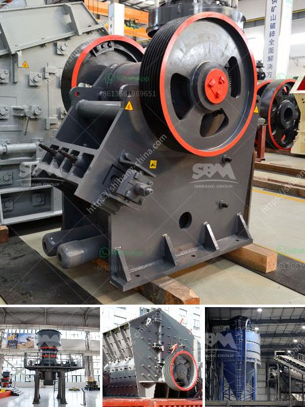

<h3>conveyor belts for sale in zambia</h3>
Conveyor belts play a crucial role in various industries, enabling the efficient movement of goods and materials. In Zambia, a country endowed with abundant natural resources and a growing economy, the demand for conveyor belts is steadily increasing. With numerous industries such as mining, agriculture, manufacturing, and logistics, the need for reliable and durable conveyor belts is paramount.

One of the main applications of conveyor belts in Zambia is within the mining industry. Zambia is known for its vast mineral reserves, and the extraction and transportation of these minerals require heavy-duty conveyor systems. Conveyor belts are essential for conveying the extracted materials from the mining sites to the processing plants or storage areas. They ensure a smooth and continuous flow of materials, minimizing downtime and maximizing productivity.

Agriculture is another thriving sector in Zambia, and conveyor belts are widely used in this industry as well. From grain handling to transporting fertilizer and animal feed, conveyor belts facilitate the movement of agricultural products efficiently and effectively. They eliminate the need for manual labor, saving time and reducing costs.

Additionally, conveyor belts are extensively utilized in manufacturing plants and warehouses, helping to streamline production processes. Whether it's assembly lines, packaging systems, or material handling, conveyor belts enable the seamless transfer of goods, improving productivity and reducing human effort.

If you are in Zambia and looking for conveyor belts for sale, there are various options available to suit your specific requirements. Local suppliers offer a wide range of conveyor belts that are designed to withstand the harsh conditions prevalent in Zambia. These belts are built with high-quality materials, ensuring longevity and resistance to wear and tear.

It is essential to consider factors such as belt width, load capacity, operating temperature, and belt speed when selecting a conveyor belt. Reliable suppliers in Zambia can guide you in choosing the right conveyor belt for your needs, ensuring optimal performance and durability.

In conclusion, conveyor belts are vital components in Zambia's industrial landscape. Whether in mining, agriculture, manufacturing, or logistics, these belts play a crucial role in efficient material handling and transportation. With the availability of conveyor belts for sale in Zambia, industries can continue to grow and thrive with improved productivity and reduced downtime.
<h3>Contact us</h3><ul><li><strong>Whatsapp:&nbsp;<a href="https://wa.me/8613661969651">+8613661969651</a></strong></li><li><a href="https://swt.shibang-china.com/?git&amp;zhl&amp;conveyor belts for sale in zambia"><strong>Online Service(chat now)</strong></a></li></ul><h3>Related</h3><ul><li><a href='calcium carbonate in kenya.md'>calcium carbonate in kenya</a></li><li><a href='gold washing machine from rock.md'>gold washing machine from rock</a></li><li><a href='used gypsum crusher machine for sale in pakistan.md'>used gypsum crusher machine for sale in pakistan</a></li><li><a href='used crushing quarry plant in south africa stone.md'>used crushing quarry plant in south africa stone</a></li><li><a href='magnetic separator manufacturers in turkey.md'>magnetic separator manufacturers in turkey</a></li></ul>