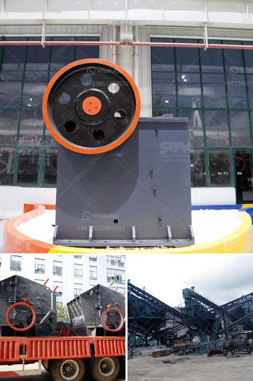

<h3>conveyor belts in east africa</h3>
In recent years, conveyor belts have become a game-changer for industries in East Africa, revolutionizing the way materials are transported and significantly enhancing productivity and efficiency. This simple yet ingenious technology has found widespread application across various sectors, such as mining, agriculture, manufacturing, and construction. East African businesses have eagerly embraced conveyor belts, recognizing their immense potential in streamlining operations and boosting overall profitability.

One of the most prominent advantages of conveyor belts is their ability to move large quantities of goods swiftly and continuously. Traditional methods of material handling often involved manual labor, which was not only time-consuming but also physically taxing. In contrast, conveyor belts automate the transportation process, reducing dependency on manpower and minimizing the risk of human error. This has led to increased productivity in industries, enabling businesses to meet high demand more efficiently and compete effectively in the market.

In mining and construction, conveyor belts are particularly invaluable. They can transport heavy loads of minerals, ores, and construction materials over long distances, minimizing the need for trucks and other vehicles. This not only reduces transportation costs but also decreases carbon emissions and helps create a more sustainable environment. Conveyor belts have played a significant role in transforming East Africa's mining and construction sectors, enabling them to operate on a larger scale and fulfill their potential in contributing to the region's economic growth.

The agricultural industry has also benefitted from the implementation of conveyor belts. They play a crucial role in streamlining the harvesting and processing of crops, such as coffee, tea, and grains. With their ability to move large volumes of produce, conveyor belts facilitate faster production cycles, reduce manual labor requirements, and ensure the efficient delivery of agricultural products to different stages of the supply chain. Farmers and agribusinesses in East Africa have embraced this technology to increase their output, improve overall quality, and meet the ever-growing demands of local and international markets.

Another area where conveyor belts have made a significant impact is manufacturing. These belts are used in assembly lines, where they transport components and products between different stages of the manufacturing process. By eliminating the need for manual handling and reducing the risk of damage or loss, conveyor belts enable manufacturers in East Africa to produce goods faster and with greater precision. This has not only enhanced competitiveness in regional markets but has also attracted foreign investors, as the region becomes increasingly recognized for its efficient and reliable manufacturing capabilities.

While conveyor belts have revolutionized industries across East Africa, it is crucial to emphasize the importance of maintenance and safety measures. Regular inspection, cleaning, and lubrication of the belts and their components are essential to ensure prolonged and effective operation. Additionally, proper training of personnel on operating conveyor belt systems and adhering to safety protocols is crucial to prevent accidents and injuries.

In conclusion, conveyor belts have brought about a remarkable transformation in East Africa's industries. From mining and construction to agriculture and manufacturing, these belts have revolutionized the way materials are transported, enhancing productivity, reducing costs, and promoting sustainability. Moving forward, it is anticipated that this technology will continue to play a vital role in East Africa's economic development, driving industries even further towards success and prosperity.
<h3>Contact us</h3><ul><li><strong>Whatsapp:&nbsp;<a href="https://wa.me/8613661969651">+8613661969651</a></strong></li><li><a href="https://swt.shibang-china.com/?git&amp;zhl&amp;conveyor belts in east africa"><strong>Online Service(chat now)</strong></a></li></ul><h3>Related</h3><ul><li><a href='how to shim a jaw crusher.md'>how to shim a jaw crusher</a></li><li><a href='cost of steel slag in tamil nadu.md'>cost of steel slag in tamil nadu</a></li><li><a href='nigeria ball mill pakistan.md'>nigeria ball mill pakistan</a></li><li><a href='calculation of crushing plant.md'>calculation of crushing plant</a></li><li><a href='small jaw crusher.md'>small jaw crusher</a></li></ul>