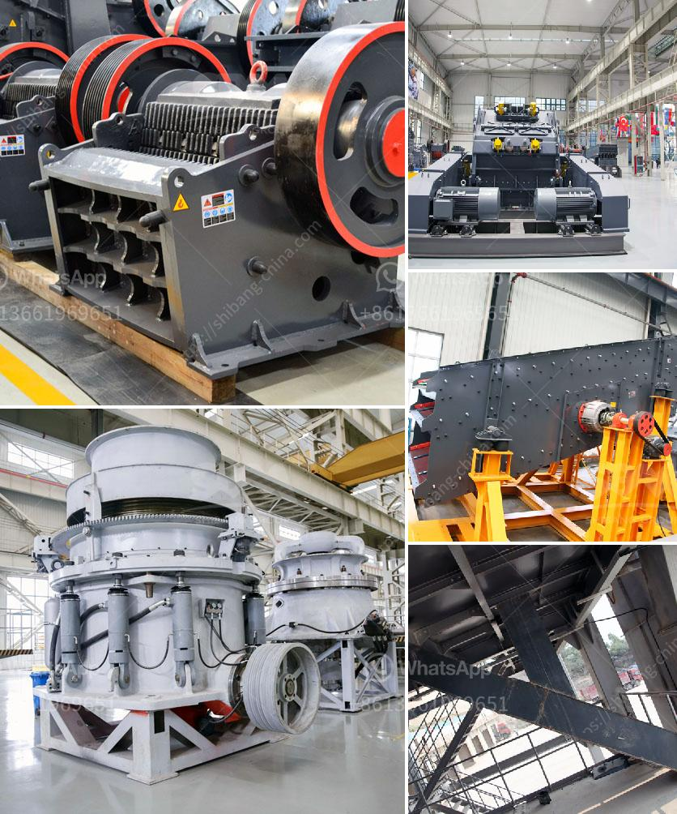

<h3>conveyor belts kenya</h3>
Kenya, one of East Africa's leading economies, has seen tremendous growth and development in various sectors in recent years. As the country continues to invest in infrastructure and industrialization projects, the demand for efficient and reliable conveyor belts has significantly increased.

Conveyor belts play a crucial role in various industries, including mining, agriculture, manufacturing, and distribution. These belts are used to transport goods and materials efficiently, reducing manual labor and improving productivity. The conveyor belt industry in Kenya has witnessed significant growth in response to the country's economic expansion.

Mining is a vital sector in Kenya's economy, contributing to the country's GDP and providing employment opportunities. Conveyor belts are essential in mining operations as they transport extracted minerals and materials from mines to processing plants or storage facilities. With Kenya's rich mineral resources, including limestone, coal, and gold, the demand for conveyor belts in the mining sector has surged.

Agriculture is another key sector in Kenya, contributing significantly to both the country's economy and employment. Conveyor belts are essential in the agricultural industry for the transportation of crops, such as wheat, maize, and coffee, from farms to storage facilities or processing plants. They help streamline the agricultural supply chain, enabling farmers to move their produce efficiently. With the increasing focus on modernizing agricultural practices in Kenya, the demand for conveyor belts has increased to meet the industry's requirements.

The manufacturing sector has also experienced significant growth in Kenya, driven by the government's efforts to promote industrialization. The use of conveyor belts in manufacturing plants is crucial for the movement of raw materials, work-in-progress goods, and finished products. Conveyor belts ensure a smooth and uninterrupted workflow, enhancing overall productivity and efficiency. As more manufacturing companies are established in Kenya, the demand for conveyor belts has risen.

The distribution and logistics sector in Kenya has witnessed substantial growth, fueled by the country's expanding middle class and the rise of e-commerce. Conveyor belts are vital in warehouses, logistics centers, and distribution hubs for the efficient movement of goods and parcels. They enable quick and automated sorting, loading, and unloading processes, reducing turnaround time and improving overall operational efficiency. With the rapid growth of online shopping and the increasing need for efficient distribution networks, the demand for conveyor belts in the logistics sector has soared.

To meet the growing demand, several conveyor belt manufacturers and suppliers have emerged in Kenya. These companies offer a wide range of conveyor belt types, including flat belts, modular belts, cleated belts, and magnetic belts, to cater to different industry requirements. Furthermore, they provide installation, maintenance, and repair services to ensure the proper functioning of conveyor systems.

In conclusion, Kenya's expanding economy, driven by sectors such as mining, agriculture, manufacturing, and distribution, has led to a surge in the demand for conveyor belts. These essential components play a crucial role in streamlining operations, improving productivity, and optimizing supply chains. With a growing number of established conveyor belt manufacturers and suppliers in Kenya, the country is well-positioned to meet its industrial and infrastructural needs. As Kenya continues to invest in its economic development, the conveyor belt industry is expected to witness further growth and contribute significantly to the country's continued success.
<h3>Contact us</h3><ul><li><strong>Whatsapp:&nbsp;<a href="https://wa.me/8613661969651">+8613661969651</a></strong></li><li><a href="https://swt.shibang-china.com/?git&amp;zhl&amp;conveyor belts kenya"><strong>Online Service(chat now)</strong></a></li></ul><h3>Related</h3><ul><li><a href='lime stone crusher in south africa.md'>lime stone crusher in south africa</a></li><li><a href='stone crusher plant cash receipt.md'>stone crusher plant cash receipt</a></li><li><a href='crusher plant for sale pakistan.md'>crusher plant for sale pakistan</a></li><li><a href='hammer mill buy.md'>hammer mill buy</a></li><li><a href='mining mobile crusher and washing lebanon.md'>mining mobile crusher and washing lebanon</a></li></ul>