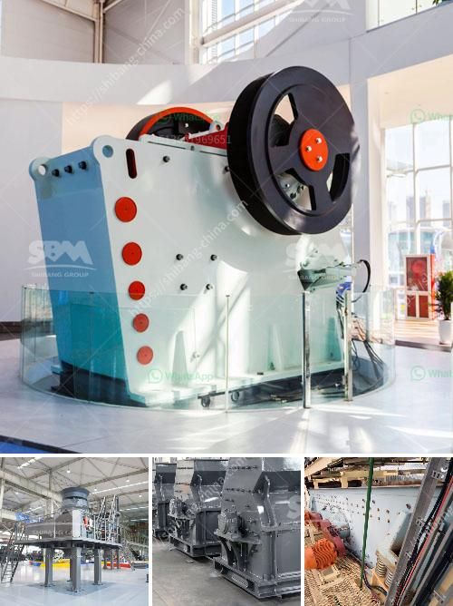

<h3>conveyor belts nigeria</h3>
Conveyor belts are essential tools in many manufacturing and industrial processes. They are used to transport materials and products from one point to another, increasing efficiency and reducing manual labor. In Nigeria, the demand for conveyor belts is steadily growing due to the country's expanding manufacturing and industrial sectors.

Nigeria, often referred to as the "Giant of Africa," is one of the largest economies on the continent. Over the years, the country has experienced significant industrial growth, particularly in sectors such as mining, agriculture, and manufacturing. With this growth, there has been an increased need for efficient and reliable conveyor systems to streamline operations and improve productivity.

One of the key industries where conveyor belts have found immense application in Nigeria is the mining sector. Nigeria is rich in various mineral resources, including oil, natural gas, coal, tin, and limestone. These resources are mined extensively, requiring the use of conveyor belts to transport extracted materials from the mining sites to processing plants or storage facilities. Conveyor belts help minimize material handling costs and increase productivity in the mining sector.

Additionally, the agricultural industry in Nigeria has also witnessed significant growth in recent years. The country has vast arable land suitable for various agricultural activities, including the cultivation of crops and rearing of livestock. Conveyor belts are crucial in agricultural processes such as sorting, grading, packaging, and transportation. They enable the efficient movement of agricultural products, such as grains, fruits, and vegetables, reducing manual labor and preserving product quality.

Moreover, the manufacturing sector in Nigeria is gradually expanding, driven by the government's efforts to diversify the economy and promote local production. Manufacturing industries, ranging from automobile assembly plants to food and beverage processing factories, heavily rely on conveyor belts for their production processes. These belts allow for the seamless movement of raw materials, intermediate products, and finished goods, facilitating efficient production and ensuring timely delivery.

However, despite the growing demand for conveyor belts in Nigeria, the industry still faces some challenges. One major challenge is the availability of quality and durable belts. Nigerian industries often rely on imported conveyor belts, resulting in high costs due to foreign exchange rates and logistics. However, efforts are being made to promote local manufacturing and production of conveyor belts to meet the growing demand and reduce dependence on imports.

Furthermore, maintenance and repair services for conveyor belts are crucial for their longevity and reliable operation. Many Nigerian industries face difficulties in accessing skilled technicians and appropriate spare parts. Establishing local training programs and workshops can bridge this skills gap and promote the growth of maintenance and repair services for conveyor belts.

In conclusion, the demand for conveyor belts in Nigeria is increasing as the country's industrial and manufacturing sectors grow. The mining, agricultural, and manufacturing industries heavily rely on conveyor belts to streamline their operations and improve efficiency. However, challenges such as the availability of quality belts and maintenance services need to be addressed to foster the growth of the conveyor belt industry in Nigeria. With adequate investment and strategic partnerships, Nigeria can become a hub for conveyor belt manufacturing and services, contributing to its economic development and self-sufficiency.
<h3>Contact us</h3><ul><li><strong>Whatsapp:&nbsp;<a href="https://wa.me/8613661969651">+8613661969651</a></strong></li><li><a href="https://swt.shibang-china.com/?git&amp;zhl&amp;conveyor belts nigeria"><strong>Online Service(chat now)</strong></a></li></ul><h3>Related</h3><ul><li><a href='gypsum making machine.md'>gypsum making machine</a></li><li><a href='materials for conveyor belts in nigeria.md'>materials for conveyor belts in nigeria</a></li><li><a href='price of stone crush machine in pakistan.md'>price of stone crush machine in pakistan</a></li><li><a href='types and prices of grinding machines.md'>types and prices of grinding machines</a></li><li><a href='cost of graphite processing plant.md'>cost of graphite processing plant</a></li></ul>