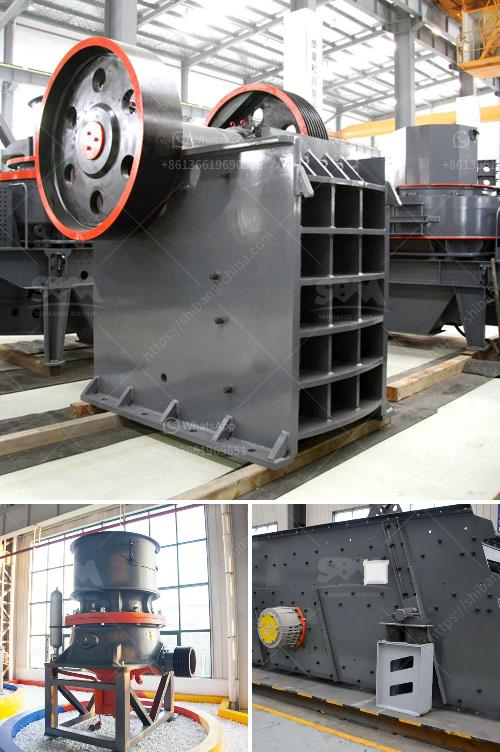

<h3>copper crusher cost</h3>
The cost of copper crushers has been increasing significantly over the past few years due to the rising demand for copper in various industries. Copper is a versatile metal with excellent conductivity and is widely used in electrical wiring, electronics, plumbing, and many other applications. As a result, the demand for copper is continuously growing, and so is the cost of copper crushers.

Copper crushers are essential equipment in the mining and ore processing industries, where they help crush and break down large chunks of ore into smaller pieces for further processing. These crushers are primarily used to extract copper from the mined ores and separate it from other impurities. The extracted copper is then processed into various forms, such as copper cathodes, copper wire, or copper tubes, depending on the specific industry requirements.

The cost of copper crushers can vary depending on several factors. One of the main factors is the size and capacity of the crusher. Crushers are available in various sizes, ranging from small handheld devices to large industrial machines. The larger the crusher's capacity and size, the higher its cost would be.

Another factor that affects the cost of copper crushers is the type of crusher being used. There are several types of crushers available in the market, such as jaw crushers, cone crushers, gyratory crushers, and impact crushers. Each type has its own advantages and disadvantages, and the cost can vary accordingly. For example, jaw crushers are generally cheaper than cone or gyratory crushers, but they may have limitations in terms of the size of the feed material they can handle.

Furthermore, the cost of copper crushers can also be influenced by the location and availability of the crusher. If the crusher needs to be transported over long distances, the logistics and transportation costs can significantly increase the overall cost. Additionally, the availability of skilled labor and technical expertise in the specific location can affect the cost of crusher installation, maintenance, and repair services.

Apart from the initial cost of copper crushers, there are also ongoing operational costs associated with their use. These costs include the electricity consumption required to power the crusher, as well as the cost of regular maintenance, such as lubrication, replacement of wear parts, and repairs. These ongoing costs should be considered when evaluating the overall cost-effectiveness of using copper crushers.

In conclusion, the cost of copper crushers has been on the rise due to the increasing demand for copper in various industries. The size, capacity, type, location, and ongoing operational costs of the crushers all contribute to the overall cost. It is essential for businesses in the mining and ore processing industries to carefully evaluate these factors to determine the most cost-effective and efficient use of copper crushers. Additionally, exploring alternative technologies and materials that can reduce reliance on copper can also help mitigate the increasing cost of copper crushers.
<h3>Contact us</h3><ul><li><strong>Whatsapp:&nbsp;<a href="https://wa.me/8613661969651">+8613661969651</a></strong></li><li><a href="https://swt.shibang-china.com/?git&amp;zhl&amp;copper crusher cost"><strong>Online Service(chat now)</strong></a></li></ul><h3>Related</h3><ul><li><a href='specification of a ball mill.md'>specification of a ball mill</a></li><li><a href='cement plant setup cost in philippines.md'>cement plant setup cost in philippines</a></li><li><a href='ballast crushing machine prices in kenya.md'>ballast crushing machine prices in kenya</a></li><li><a href='hammer mill buy.md'>hammer mill buy</a></li><li><a href='used crushing quarry plant in south africa stone.md'>used crushing quarry plant in south africa stone</a></li></ul>