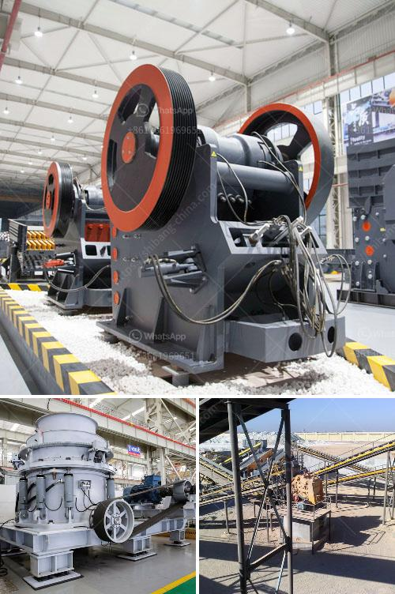

<h3>copper factory layout design</h3>
When it comes to designing a copper factory layout, there are several important factors to consider. Efficiency and safety should be the top priorities, as they directly impact productivity and employee well-being. A well-thought-out layout can ensure smooth workflow, minimize operational costs, and reduce the chances of accidents in the workplace. In this article, we will explore key considerations for designing an efficient and safe copper factory layout.

The first step in designing a copper factory layout is to analyze the production process thoroughly. Understanding the various stages involved in copper production, such as smelting, refining, casting, and finishing, is crucial. This analysis will help determine the ideal placement of different workstations and equipment, ensuring the smooth flow of materials and minimizing unnecessary movement.

A logical flow of materials should be established within the layout, starting from the arrival of raw materials to the final product. This can be achieved by arranging workstations in a sequence that corresponds to the production process. For instance, the raw material storage area should be located near the smelting section, enabling easy access and reducing transportation time.

Efficient space utilization is another key consideration in factory layout design. Effective space planning ensures maximum utilization of available resources while providing enough room for machinery, storage areas, and employee movement. It is advisable to allocate sufficient space between workstations to prevent congestion and allow employees to move comfortably. Implementing lean manufacturing principles, such as grouping similar processes together, can optimize workflows and minimize wasted space.

Safety considerations should never be compromised in the design of a copper factory layout. The layout should adhere to safety regulations, ensuring easy access to emergency exits, fire safety equipment, and first aid stations. Hazardous areas, such as smelting and refining sections, should be isolated and equipped with appropriate ventilation and safety measures to protect workers from harmful fumes and chemicals. Implementing safety signage and clear demarcation of walkways can further enhance workplace safety.

Ergonomics is an essential aspect of factory layout design. Workstations should be designed ergonomically, considering factors such as height-adjustable workbenches, proper lighting, and comfortable seating arrangements. This helps prevent musculoskeletal disorders and enhances employee productivity. Additionally, storage areas and materials handling equipment should be conveniently placed to reduce the risk of manual handling injuries.

To enhance efficiency, the layout should also consider the flow of information. Communication between different departments and employees is crucial for seamless production. Placing offices, meeting rooms, and communication systems strategically within the layout can facilitate effective communication and quick decision-making.

Regularly reviewing and optimizing the factory layout is essential, as business needs and technology evolve with time. Consider incorporating flexibility into the design to accommodate future changes. Modular workstations and adaptable layouts enable easy modifications without disrupting daily operations. Additionally, conducting regular safety audits and employee feedback sessions can highlight potential areas of improvement and enhance overall efficiency and safety.

In conclusion, designing an efficient and safe copper factory layout requires comprehensive planning and attention to detail. Analyzing the production process, optimizing space utilization, adhering to safety regulations, considering ergonomics, and promoting effective communication are all crucial aspects. By implementing these considerations, copper factories can maximize efficiency, minimize costs, and provide a safe workplace environment for their employees.
<h3>Contact us</h3><ul><li><strong>Whatsapp:&nbsp;<a href="https://wa.me/8613661969651">+8613661969651</a></strong></li><li><a href="https://swt.shibang-china.com/?git&amp;zhl&amp;copper factory layout design"><strong>Online Service(chat now)</strong></a></li></ul><h3>Related</h3><ul><li><a href='mkobo crushing and screen.md'>mkobo crushing and screen</a></li><li><a href='roller mill ultrafine.md'>roller mill ultrafine</a></li><li><a href='types and prices of grinding machines.md'>types and prices of grinding machines</a></li><li><a href='tractor pto stone crusher for sale.md'>tractor pto stone crusher for sale</a></li><li><a href='mobile crusher datasheet.md'>mobile crusher datasheet</a></li></ul>