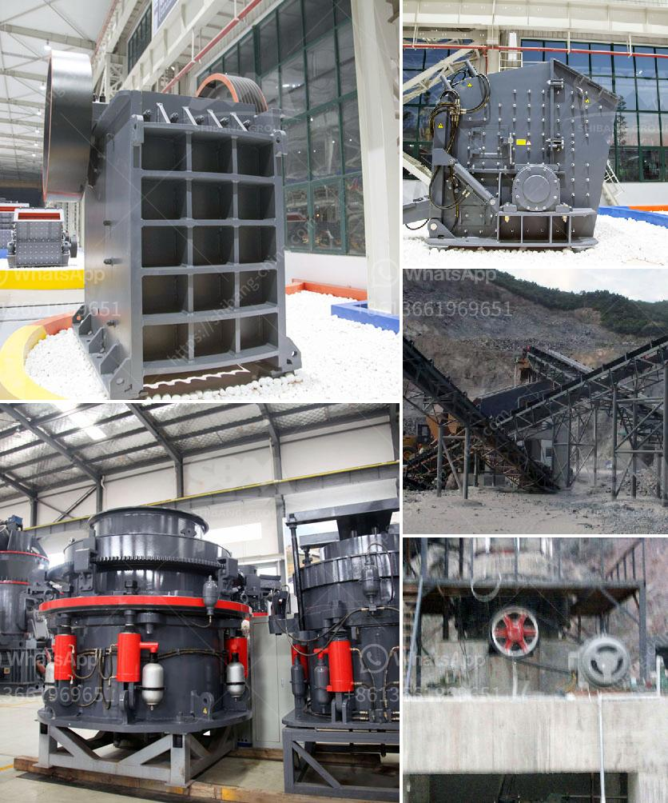

<h3>copper mining process</h3>
Copper mining is a complex and intensive process that involves extracting copper metal from its minerals. The process begins with blasting and collection of the ore from the massive open-pit mines. From there, it is crushed, ground, and delivered to flotation cells where the copper minerals are separated from the surrounding waste rock.

The first step in the copper mining process is exploration. Geologists search for areas of potential copper deposits by analyzing rock samples, conducting geological surveys, and using various remote sensing techniques. Once a potential deposit is identified, the site is further assessed for its economic viability.

Once a deposit is deemed feasible, the next step is to plan and develop the mine. Roads, access points, and infrastructure are constructed to facilitate the transportation of equipment, supplies, and personnel to and from the site. Power lines and water sources are established to provide energy and resources for the mining operations.

After the mine is developed, the extraction process starts with drilling and blasting. Explosives are used to break apart the rock and loosen the copper ore. Huge trucks and shovels are used to transport the blasted material to the processing plant.

At the processing plant, the crushed ore is further ground into a fine powder. This process, known as milling, helps to free the copper minerals from the surrounding rock. Water and chemicals are added to the mill to create a slurry, which is then fed into flotation cells.

In the flotation cells, various chemicals and air are added to separate the copper minerals from the unwanted waste rock. The minerals attach to bubbles and rise to the surface while the waste rock sinks to the bottom. The copper concentrate is skimmed off, filtered, and dried to remove excess moisture.

The final stage of the copper mining process involves smelting the copper concentrate to produce pure copper metal. The concentrate is mixed with fluxes, which help remove impurities, and then heated in a furnace. The molten copper is then poured into molds to cool and solidify into bars or ingots.

While copper mining is an essential industry that supplies us with this valuable metal, it does come with several environmental and social impacts. The extraction process can generate large amounts of waste rock and tailings, which may contain toxic substances. Additionally, mining operations require a significant amount of water and energy, contributing to resource depletion and greenhouse gas emissions.

To mitigate these impacts, mining companies are increasingly adopting sustainable practices, such as recycling water, improving energy efficiency, and implementing responsible waste management. They are also improving the reclamation and rehabilitation of mined areas to restore the natural habitat and biodiversity.

In conclusion, the copper mining process is a complex and resource-intensive operation that involves several stages, from exploration to smelting. While it is vital for supplying us with this valuable metal, it also presents environmental and social challenges. As the demand for copper continues to grow, it is essential for the industry to adopt sustainable practices and minimize its impact on the environment and local communities.
<h3>Contact us</h3><ul><li><strong>Whatsapp:&nbsp;<a href="https://wa.me/8613661969651">+8613661969651</a></strong></li><li><a href="https://swt.shibang-china.com/?git&amp;zhl&amp;copper mining process"><strong>Online Service(chat now)</strong></a></li></ul><h3>Related</h3><ul><li><a href='thailand granite quarry crusher.md'>thailand granite quarry crusher</a></li><li><a href='difference between ball mill and roller mill.md'>difference between ball mill and roller mill</a></li><li><a href='vertical roller mill manufacture in tamilnadu.md'>vertical roller mill manufacture in tamilnadu</a></li><li><a href='crusher plant in sri lanka.md'>crusher plant in sri lanka</a></li><li><a href='stone quarry drill machine crushers prices.md'>stone quarry drill machine crushers prices</a></li></ul>