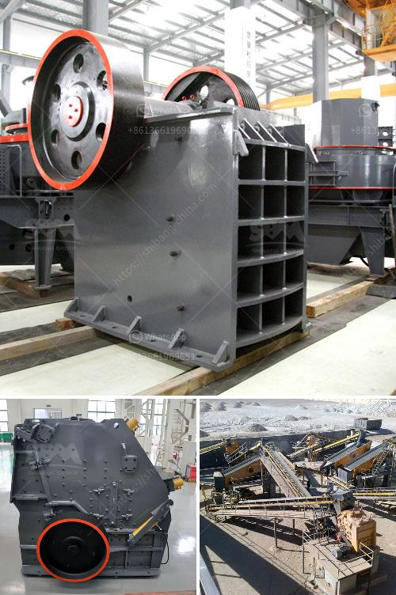

<h3>copper ore melting machines</h3>
Copper ore is a valuable resource that can be found in nature and has been mined for centuries. In its raw form, copper ore does not have many uses, but after it goes through a specific process, it becomes a valuable metal with numerous applications in various industries. Melting copper ore is a crucial step in this process, and there are machines designed specifically for this purpose.

Melting copper ore requires high temperatures to separate the copper from the impurities and create a molten copper solution. Copper ore melting machines are designed to provide the necessary heat and control for melting the ore efficiently and effectively. These machines are an essential part of the copper mining industry, as they play a crucial role in turning raw copper ore into usable metal.

One type of copper ore melting machine commonly used is the reverberatory furnace. This furnace consists of a large, shallow hearth lined with refractory bricks. The copper ore is fed into the furnace through an opening at one end while fuel and air are blown into the opposite end. The fuel, usually coal or natural gas, is burned to create a fire that spreads across the hearth. The heat produced by the fire radiates onto the copper ore, causing it to melt and separate from the impurities.

Reverberatory furnaces are efficient in melting copper ore because of their design. The shallow hearth allows for a large surface area, ensuring that the copper ore is exposed to the heat evenly. The refractory bricks lining the furnace help maintain the high temperatures required for melting the copper and protect the surrounding walls from damage.

Another type of copper ore melting machine is the flash smelting furnace. Unlike reverberatory furnaces, flash smelting furnaces use oxygen-enriched air instead of a separate fuel source to create the necessary heat. The copper ore is blown into the furnace along with hot air, and the oxygen reacts with the impurities, creating high temperatures that melt the copper.

Flash smelting furnaces are known for their high efficiency and ability to produce large quantities of copper. The use of oxygen-enriched air allows for better combustion, resulting in higher temperatures and more effective removal of impurities. These furnaces also have a smaller physical footprint and require less fuel, making them more environmentally friendly.

Both reverberatory and flash smelting furnaces are essential to the copper mining industry, but choosing the right type of copper ore melting machine depends on various factors. The choice may depend on factors such as the desired throughput, the quality of the ore, and the availability of resources like fuel and oxygen.

In conclusion, copper ore melting machines are essential equipment in the copper mining industry. These machines, such as reverberatory and flash smelting furnaces, provide the necessary heat and control to melt copper ore effectively. Through their use, raw copper ore can be transformed into valuable metal, ready for use in various industries. The choice of the melting machine depends on specific requirements, but all aim to achieve efficient and effective separation of copper from impurities.
<h3>Contact us</h3><ul><li><strong>Whatsapp:&nbsp;<a href="https://wa.me/8613661969651">+8613661969651</a></strong></li><li><a href="https://swt.shibang-china.com/?git&amp;zhl&amp;copper ore melting machines"><strong>Online Service(chat now)</strong></a></li></ul><h3>Related</h3><ul><li><a href='mobile fine jaw crusher at saudi arabia.md'>mobile fine jaw crusher at saudi arabia</a></li><li><a href='silica sand crusher in turkey.md'>silica sand crusher in turkey</a></li><li><a href='used raymond mill for sale in taiwan crusher.md'>used raymond mill for sale in taiwan crusher</a></li><li><a href='limestone powder making machine india.md'>limestone powder making machine india</a></li><li><a href='dolomite powder mesh.md'>dolomite powder mesh</a></li></ul>