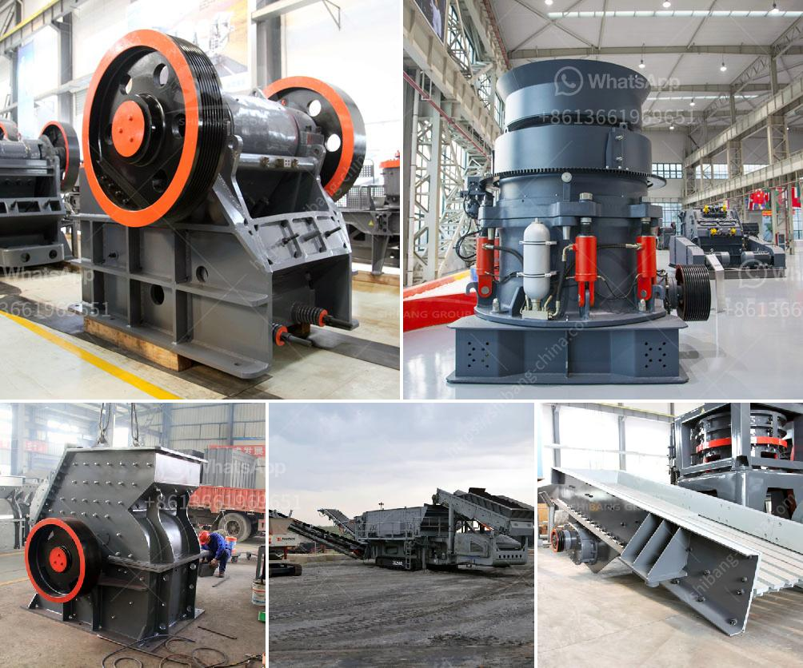

<h3>copper oxide concentrate processing machines</h3>
Copper oxide concentrate is a key raw material used for the production of copper, a versatile metal that is widely used in various industries such as construction, electrical engineering, transportation, and more. In order to extract copper from the oxide concentrate, a series of processing machines are required. These machines play a crucial role in ensuring efficient and effective copper extraction. 

One of the primary processing machines used in copper oxide concentrate processing is the ball mill. A ball mill is a cylindrical device that grinds down materials into fine particles. It is commonly used in grinding and mixing applications in the chemical, ceramic, and construction industries. In the copper oxide concentrate processing, the ball mill is used to grind the concentrate into a fine powder, which is further processed to separate the copper from other minerals.

Another important processing machine is the flotation machine. Flotation is a widely used separation technique in the mining industry to separate valuable minerals from their ore. In the case of copper oxide concentrate processing, the flotation machine is used to separate the copper minerals from the gangue minerals. The concentrate is mixed with water and chemicals, and air is blown through the mixture. The copper minerals attach to air bubbles and rise to the surface, forming a froth, which is then collected and processed to obtain the pure copper concentrate.

Electrostatic separators are also commonly used in the processing of copper oxide concentrate. These machines utilize the differences in surface electrical conductivity of minerals to separate them. Copper minerals have different electrical conductivities compared to other minerals, allowing for their efficient separation. Electrostatic separators apply an electric field to induce electrical charges on the particles, causing them to be attracted or repelled towards charged plates. This process effectively separates the copper minerals from the gangue minerals, producing a purified copper concentrate.

Additionally, rotary kilns are often used in copper oxide concentrate processing. Rotary kilns are large, refractory-lined cylinders that rotate slowly on their axes. They are used for heat treatment processes such as roasting, calcination, and sintering. In the case of copper oxide concentrate, the rotary kiln is used for roasting. This process involves heating the concentrate to a high temperature in the presence of oxygen to remove impurities and convert the copper oxide minerals to copper metal.

In conclusion, copper oxide concentrate processing machines are essential for the extraction of copper from the concentrate. These machines include ball mills for grinding, flotation machines for separation, electrostatic separators for further separation, and rotary kilns for heat treatment. Each machine plays a vital role in the overall copper extraction process, ensuring efficient and effective production of copper for various industries.
<h3>Contact us</h3><ul><li><strong>Whatsapp:&nbsp;<a href="https://wa.me/8613661969651">+8613661969651</a></strong></li><li><a href="https://swt.shibang-china.com/?git&amp;zhl&amp;copper oxide concentrate processing machines"><strong>Online Service(chat now)</strong></a></li></ul><h3>Related</h3><ul><li><a href='ball mill 5 tonnes.md'>ball mill 5 tonnes</a></li><li><a href='stone crushers in malaysia.md'>stone crushers in malaysia</a></li><li><a href='estimasi biaya usaha stone crusher.md'>estimasi biaya usaha stone crusher</a></li><li><a href='hammer mill for sale gumtree.md'>hammer mill for sale gumtree</a></li><li><a href='grinding machines sales in namibia.md'>grinding machines sales in namibia</a></li></ul>