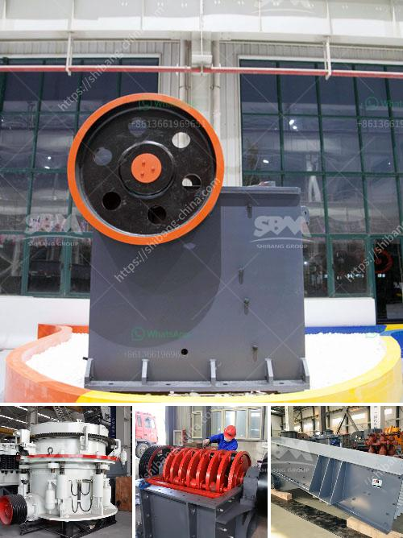

<h3>cornerstone equipment used rock crushers</h3>
Rock crushers play a vital role in the extraction of minerals, as they break down large rocks into smaller, more manageable pieces. They are commonly used in construction, mining, and aggregate industries. One leading provider of high-quality rock crushers is Cornerstone Equipment.

Cornerstone Equipment is a trusted name in the industry, known for its commitment to quality and durability. With over 30 years of experience, they have been providing reliable solutions to meet the crushing needs of their customers. Their range of rock crushers includes various models designed to handle different types of materials and applications.

One of the primary advantages of Cornerstone Equipment's rock crushers is their versatility. Whether you're crushing limestone, granite, or concrete, their crushers are designed to handle a wide range of materials. This makes them suitable for various industries, including mining, construction, and recycling. With adjustable crushing settings and different sizes of screens, these crushers can produce different sizes of aggregates, making them adaptable to the specific requirements of each project.

In addition to their versatility, Cornerstone Equipment's rock crushers are also known for their efficiency and reliability. Their robust construction ensures that these machines can handle the toughest materials, reducing the risk of downtime. Equipped with powerful engines and advanced crushing technology, these crushers are built to deliver high productivity and consistent performance.

Safety is another critical consideration when it comes to rock crushing equipment. Cornerstone Equipment understands the importance of providing a safe working environment for operators. Their crushers are designed with safety features such as emergency shutdown buttons, protective guards, and easy access to maintenance areas. This helps to minimize accidents and ensure the well-being of operators.

Cornerstone Equipment's commitment to customer satisfaction is evident in their excellent after-sales service. Their team of experienced technicians is readily available to provide support and assistance, ensuring that their customers receive the necessary help whenever needed. They also offer comprehensive training programs to educate operators on the safe and efficient operation of their equipment.

For those looking to invest in rock crushers, Cornerstone Equipment offers competitive pricing options. They understand the importance of cost-effectiveness in today's competitive environment. With their wide range of crushers and financing options, they aim to provide solutions that meet both budget and operational requirements.

In conclusion, Cornerstone Equipment is a reliable provider of rock crushers. Their versatile and efficient machines are designed to handle various materials and applications. With a focus on safety and customer satisfaction, they deliver high-quality solutions that can boost productivity and minimize downtime. Whether you're in construction, mining, or recycling, Cornerstone Equipment has the rock crusher to suit your needs. Contact them today to discuss your crushing requirements and experience the difference they can make in your operations.
<h3>Contact us</h3><ul><li><strong>Whatsapp:&nbsp;<a href="https://wa.me/8613661969651">+8613661969651</a></strong></li><li><a href="https://swt.shibang-china.com/?git&amp;zhl&amp;cornerstone equipment used rock crushers"><strong>Online Service(chat now)</strong></a></li></ul><h3>Related</h3><ul><li><a href='vibration screen machine in pakistan.md'>vibration screen machine in pakistan</a></li><li><a href='crusher for sale 120 ton.md'>crusher for sale 120 ton</a></li><li><a href='lime dolomite plant in philippines.md'>lime dolomite plant in philippines</a></li><li><a href='used stone crushers for ballast sale.md'>used stone crushers for ballast sale</a></li><li><a href='cold roll mills in turkey.md'>cold roll mills in turkey</a></li></ul>