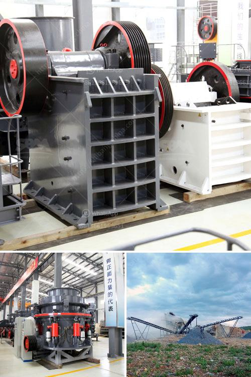

<h3>cost estimate ball mill</h3>
A ball mill is a type of grinder used to grind materials into extremely fine powder for use in mineral dressing processes, paints, pyrotechnics, ceramics and selective laser sintering. The ball mill is known for its versatility and wide application range, as it can grind almost any type of material from hard and abrasive substances to soft and fibrous ones. With this in mind, many industries find the ball mill indispensable in the production process.

When it comes to estimating the cost of a ball mill, there are several factors that need to be considered. These include the nature of the project, such as its scale and duration, the size of the equipment, and the materials to be processed. Additionally, the cost estimate should also take into account any additional equipment necessary for the operation, such as conveyors, filters, and pumps.

One of the primary factors that determine the cost of a ball mill is its size. Larger mills are generally more expensive than smaller ones due to the increased complexity of their construction and the higher amount of materials needed. Additionally, larger mills have higher energy consumption and maintenance costs. On the other hand, smaller mills may have lower throughput rates and require frequent replacement of grinding media.

Another crucial factor in estimating the cost of a ball mill is the type of materials to be processed. Different materials have different properties and require specific types of mills. For example, soft and fibrous materials, such as cellulose and textile fibers, may require a different type of mill than hard and abrasive materials, such as rocks and ores. The type of mill required for a specific material can significantly impact the overall cost estimate.

Furthermore, the cost estimate should also include the cost of any additional equipment necessary for the operation. For instance, if the material to be processed requires grinding or the use of a specific type of media, such as ceramic balls or steel rods, these should be taken into account. Additionally, if the operation involves the transportation of materials to and from the mill, conveyors or other systems should also be factored into the cost estimate.

In conclusion, estimating the cost of a ball mill requires considering several factors. These include the nature of the project, the size of the mill, and the type of materials to be processed. Additionally, any additional equipment necessary for the operation should also be included in the cost estimate. By carefully considering these factors, an accurate cost estimate can be determined, which can help guide decisions related to the purchase and installation of a ball mill.
<h3>Contact us</h3><ul><li><strong>Whatsapp:&nbsp;<a href="https://wa.me/8613661969651">+8613661969651</a></strong></li><li><a href="https://swt.shibang-china.com/?git&amp;zhl&amp;cost estimate ball mill"><strong>Online Service(chat now)</strong></a></li></ul><h3>Related</h3><ul><li><a href='cement making machinery for whole cement plant.md'>cement making machinery for whole cement plant</a></li><li><a href='kaolin powder machine.md'>kaolin powder machine</a></li><li><a href='used stone crusher machine japan.md'>used stone crusher machine japan</a></li><li><a href='used mobile jaw crusher for sale uk.md'>used mobile jaw crusher for sale uk</a></li><li><a href='process of making diamonds from coal.md'>process of making diamonds from coal</a></li></ul>