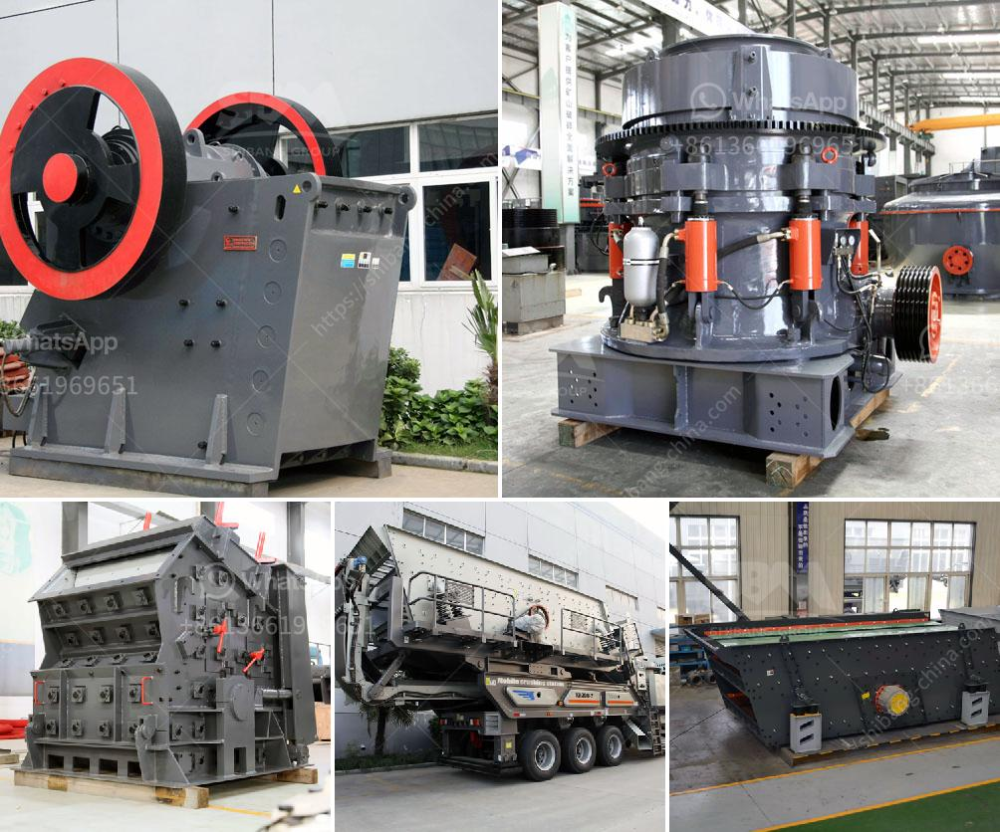

<h3>cost of 100 tpd cement plant</h3>
The cement industry is undoubtedly an important part of the construction sector, as it plays a key role in meeting the growing demand for infrastructure development. With the increasing population and the rapid urbanization of cities, the need for cement is expected to soar in the coming years.

Setting up a cement plant is a profitable venture, however, it comes with its fair share of financial considerations. The cost of establishing a cement plant varies depending on factors such as location, availability of limestone mines, climate conditions, quality of raw materials, government regulations, and more. 

For a plant with a capacity of 100 tons per day (TPD), the initial investment could be in the range of $1 million to $5 million. This includes the cost of land, building, machinery, and equipment. The specific technology and design of the plant also affect the total cost. Advanced and efficient technologies tend to have a higher initial investment but offer long-term benefits in terms of energy efficiency and production capacity.

Apart from the capital expenditure, there are operational costs to be considered as well. These include labor expenses, power and fuel costs, raw material procurement, transportation, maintenance, and administrative expenses. The actual operating cost can vary greatly depending on factors such as the market price of materials and energy sources, wage rates, and overall plant efficiency.

It is important to note that the cost estimates mentioned here are just rough approximations and can vary significantly depending on regional factors and project-specific requirements. Hence, it is always advisable to conduct a detailed feasibility study and seek professional assistance to determine accurate cost estimates when planning to set up a cement plant.

The cement industry has tremendous potential for growth, and a well-planned and efficiently managed cement plant has the potential to generate substantial returns on investment. Before embarking on such a venture, it is crucial to thoroughly analyze the market, study the competitive landscape, and factor in all the financial implications to ensure a successful and profitable cement plant operation.
<h3>Contact us</h3><ul><li><strong>Whatsapp:&nbsp;<a href="https://wa.me/8613661969651">+8613661969651</a></strong></li><li><a href="https://swt.shibang-china.com/?git&amp;zhl&amp;cost of 100 tpd cement plant"><strong>Online Service(chat now)</strong></a></li></ul><h3>Related</h3><ul><li><a href='manufacturer of portable floatation plant in china.md'>manufacturer of portable floatation plant in china</a></li><li><a href='contact address puzzolana cone crusher.md'>contact address puzzolana cone crusher</a></li><li><a href='impact crusher 5tph for sale south africa.md'>impact crusher 5tph for sale south africa</a></li><li><a href='rock crusher companies.md'>rock crusher companies</a></li><li><a href='river stone crushing machine.md'>river stone crushing machine</a></li></ul>