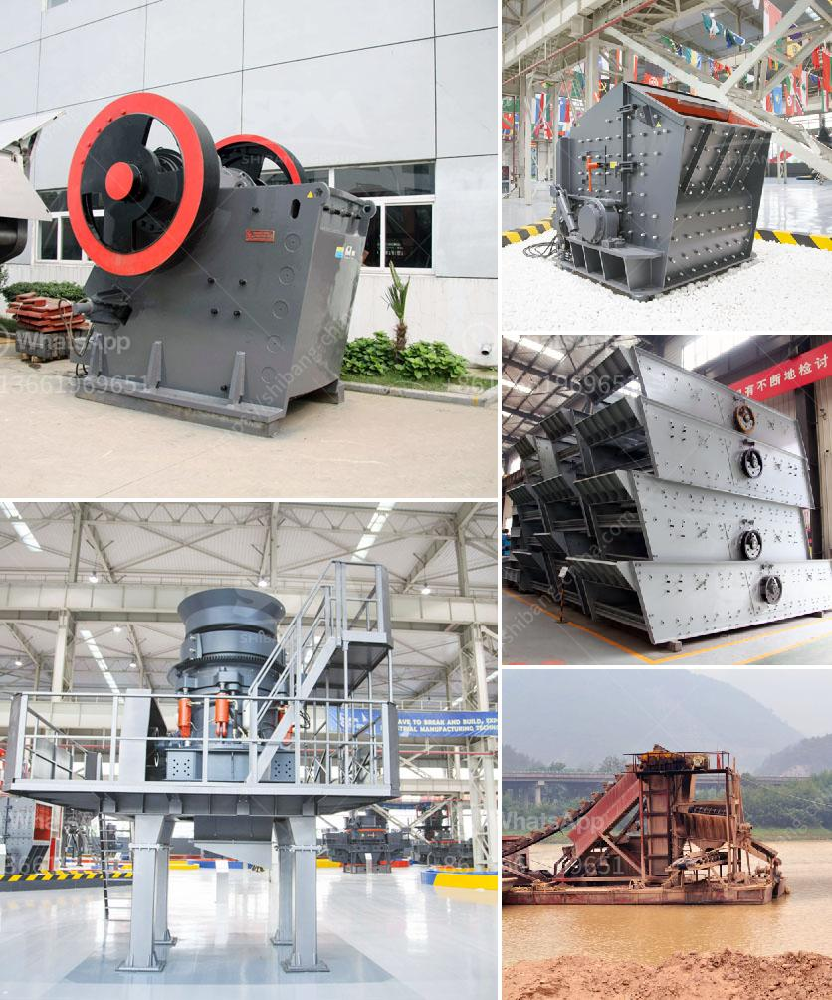

<h3>cost of a hammer mill</h3>
In today's competitive business landscape, efficiency and cost-effective solutions are paramount for any industry. One machine that plays a critical role in various manufacturing processes is a hammer mill. This versatile piece of equipment is widely used in sectors such as agriculture, food processing, oil extraction, textile, and pharmaceuticals. However, it is crucial to understand the cost implications associated with owning and operating a hammer mill before making a purchase decision.

The initial cost of a hammer mill can vary greatly depending on the size, model, and features chosen. On average, a basic model can range from $5000 to $15,000, while more advanced versions can cost up to $30,000 or more. The cost will be determined by factors such as the desired capacity, power requirements, material handling capabilities, and overall durability.

Capacity is an essential consideration when determining the cost of a hammer mill. Higher capacities often come with a higher price tag due to the need for stronger motors, better control mechanisms, and sturdier construction materials. It is crucial to analyze production requirements and choose a hammer mill that aligns with the desired output levels.

Power requirements should also be factored into the cost equation. Hammer mills are typically powered by electricity or diesel engines, with electricity being the most common choice for industrial applications. An electric-powered hammer mill may seem like the more eco-friendly option initially, but it could have higher energy consumption costs in the long run. On the other hand, diesel-powered hammer mills offer greater portability for remote or off-grid locations, but the fluctuating fuel prices should be considered.

Material handling capabilities play a significant role in determining the cost-effectiveness of a hammer mill. The machine should have the ability to handle and process various raw materials efficiently to maximize productivity. Hammer mills with advanced features like adjustable blades, interchangeable screens, and automatic feed mechanisms might come with a higher price tag but can enhance versatility and overall performance.

The cost of a hammer mill extends beyond the purchase price, as ongoing operational expenses need to be considered. Several factors can affect the operational costs, such as maintenance, repair, and replacement of worn-out parts. Inadequate routine maintenance can lead to increased downtime and reduced productivity. It is advisable to factor in regular maintenance costs when budgeting for a hammer mill.

Furthermore, the overall durability and lifespan of the hammer mill should be assessed. Although higher-priced models may initially seem expensive, they often boast better quality materials, superior engineering, and longer lifespans compared to cheaper alternatives. It is important to balance initial cost with long-term savings and overall Return on Investment (ROI).

In conclusion, the cost of a hammer mill should be assessed by considering various factors such as capacity, power requirements, material handling capabilities, operational expenses, and durability. It is advisable to consult with industry experts or manufacturers to determine the best model that aligns with production needs and budget limitations. Investing in a reliable hammer mill can enhance efficiency, reduce labor costs, and ultimately contribute to the overall success of many industries.
<h3>Contact us</h3><ul><li><strong>Whatsapp:&nbsp;<a href="https://wa.me/8613661969651">+8613661969651</a></strong></li><li><a href="https://swt.shibang-china.com/?git&amp;zhl&amp;cost of a hammer mill"><strong>Online Service(chat now)</strong></a></li></ul><h3>Related</h3><ul><li><a href='new gypsum board plant in india.md'>new gypsum board plant in india</a></li><li><a href='crusher machine price list.md'>crusher machine price list</a></li><li><a href='ball mill 800 ton day.md'>ball mill 800 ton day</a></li><li><a href='rock crushers in south africa.md'>rock crushers in south africa</a></li><li><a href='impact crusher 5tph for sale south africa.md'>impact crusher 5tph for sale south africa</a></li></ul>