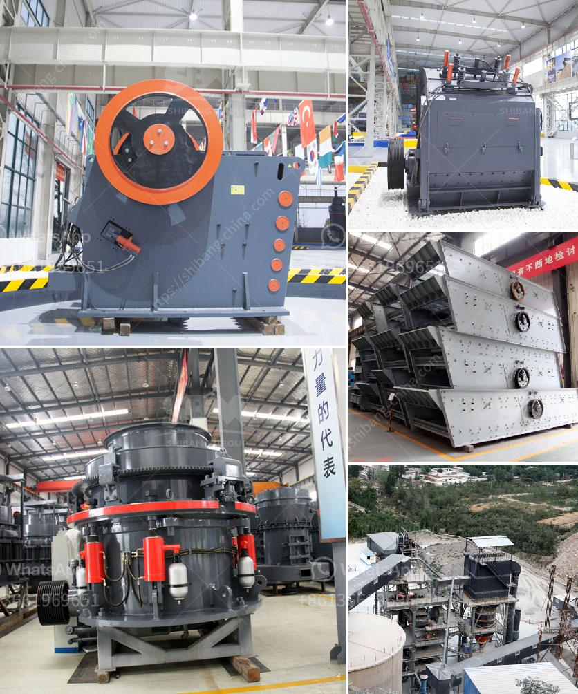

<h3>cost of a jaw crusher in india</h3>
The price of a jaw crusher in India is not fixed and can vary greatly depending on factors such as the capacity, the brand, the model, the type of jaw crusher required and many other aspects. It remains to be seen how much a rock crusher of multiple types will cost when it comes to India. Infrastructure is crucial for residential and also business building and construction tasks at every level of the sector, for this reason, this requires making use of an affordable variety of tools, equipment, and also machinery. The same holds true for rock crushers which are a fundamental requirement for any big range reconstruction job. With the boosting shortage of all-natural resources and also quick building and construction pace, there is better need for a jaw crusher in India. With abundant mineral deposits throughout the country, mining has actually become a leading market for numerous private and also public sector organizations, making high need for the same. A jaw crusher is a gadget designed to decrease the dimension of rocks or stones in different phases of squashing by means of 2 jaw plates. Among the jaw plates is repaired run out and also remains in a set location, the various other is movable and also returns and forth about the other jaw plate. The dimension of a jaw crusher can be specified by the rectangular shape of the feed opening. As an example, a 24 x 36 jaw crusher steps 24" from jaw die to jaw die at the top opening or gape opening and also 36" across the width of both jaw dies. The narrower bottom opening of the squashing chamber is utilized to size the discharge product.
<h3>Contact us</h3><ul><li><strong>Whatsapp:&nbsp;<a href="https://wa.me/8613661969651">+8613661969651</a></strong></li><li><a href="https://swt.shibang-china.com/?git&amp;zhl&amp;cost of a jaw crusher in india"><strong>Online Service(chat now)</strong></a></li></ul><h3>Related</h3><ul><li><a href='hard rock quarry crusher in libya.md'>hard rock quarry crusher in libya</a></li><li><a href='used crusher in tanzania.md'>used crusher in tanzania</a></li><li><a href='suppliers of coveyor belting in durban.md'>suppliers of coveyor belting in durban</a></li><li><a href='crusher machine plant.md'>crusher machine plant</a></li><li><a href='cost of a hammer mill.md'>cost of a hammer mill</a></li></ul>