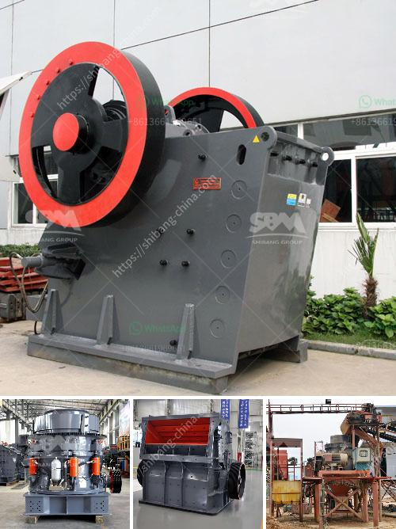

<h3>cost of bentonite manufacturing processing plant</h3>
The cost of establishing a bentonite manufacturing processing plant can range from several thousand dollars to millions of dollars, depending on the scale and depth of the plant. As per a standard estimation, the cost of setting up a small-scale bentonite manufacturing processing plant ranges from $250,000 to $1 million. For a medium-sized plant, the cost may vary between $1 million to $3 million. And for a large-scale plant capable of producing a significant amount of bentonite, the cost may range from $3 million to $10 million or even more. It is important to note that these cost estimates are subject to fluctuations in market conditions, cost of equipment, and raw material availability.

To better understand the cost breakdown, we can further analyze the main elements associated with establishing a bentonite manufacturing processing plant:

1. Land and Infrastructure: The cost of purchasing or leasing land for the plant facility is an initial expense. In addition, construction costs, utilities, and the overall infrastructure needed for the manufacturing process must be considered. These costs may vary depending on the location, such as urban or rural areas, and the availability of resources.

2. Machinery and Equipment: Essential machinery and equipment are required to process and manufacture bentonite products. This includes crushers, grinders, mixers, dryers, conveyors, and packaging machinery. The price of such machinery can vary greatly depending on the size, quality, and brand. It is crucial to invest in reliable and efficient machinery to ensure the productivity and profitability of the plant.

3. Raw Materials: Bentonite is derived from clay deposits and is a key ingredient in many industrial applications. The cost of acquiring bentonite deposits or purchasing raw materials can be a significant expense. It is important to consider the location of the plant in relation to raw material availability and transportation costs, as these factors can impact the overall manufacturing cost.

4. Labor and Training: Employing a qualified workforce is crucial for the successful operation of a manufacturing processing plant. The cost of labor includes wages, benefits, and training expenses. The complexity of the manufacturing process may require specialized personnel, adding to the labor cost. Proper training and investment in employee development can enhance productivity and reduce operational costs in the long run.

5. Regulatory Compliance: Compliance with environmental and safety regulations is essential in establishing a manufacturing processing plant. Costs associated with obtaining permits, licenses, and complying with regulations must be considered. These expenses can vary depending on jurisdiction and the specific requirements for the bentonite industry.

In conclusion, the cost of establishing a bentonite manufacturing processing plant can vary significantly depending on several factors. These include the scale of the plant, machinery and equipment, raw material availability, land and infrastructure, labor costs, and regulatory compliance. Thorough planning, market analysis, and financial assessment are necessary steps before venturing into the bentonite manufacturing industry.
<h3>Contact us</h3><ul><li><strong>Whatsapp:&nbsp;<a href="https://wa.me/8613661969651">+8613661969651</a></strong></li><li><a href="https://swt.shibang-china.com/?git&amp;zhl&amp;cost of bentonite manufacturing processing plant"><strong>Online Service(chat now)</strong></a></li></ul><h3>Related</h3><ul><li><a href='impact hammer crusher.md'>impact hammer crusher</a></li><li><a href='small scale cement plants in india.md'>small scale cement plants in india</a></li><li><a href='cone crusher design guideline pdf.md'>cone crusher design guideline pdf</a></li><li><a href='special electrodes for ball mill.md'>special electrodes for ball mill</a></li><li><a href='crusher for sale in dubai.md'>crusher for sale in dubai</a></li></ul>