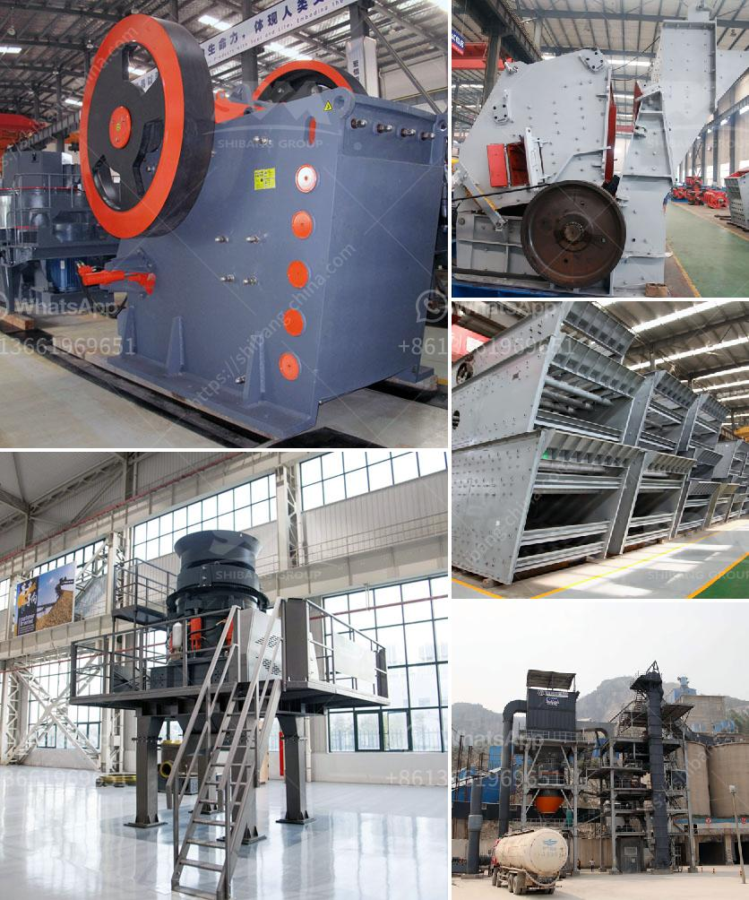

<h3>cost of cone crusher</h3>
The cone crusher is a crushing machine that is commonly used in mining, metallurgical, construction, chemical and other industries. It can be used to crush hard and medium-hard minerals, rocks, iron ores, limestone, copper ores, quartz, granite, sandstones, etc. In a whole production line, usually, the cone crusher is used for secondary or tertiary crushing process, or first crushing.

When it comes to the cost of cone crusher, it is worthy of mentioning that only improving the crushing efficiency is not enough to save the cost. Therefore, you need to consider other factors like cost of labor, parts, maintenance cost, power consumption, etc.

Firstly, the cost of labor is an important consideration. In the quarry, operators need to hire workers to dig, load, haul, and crush the materials. Depending on the location and labor market, the cost of labor can vary significantly. It is important to plan and budget for the labor cost when calculating the cost of a cone crusher.

Secondly, the cost of parts is another major aspect. The cone crusher consists of many parts, such as frame, transmission mechanism, eccentric sleeve, bowl-shaped bearing, crushing cone, adjusting device, adjusting sleeve, hydraulic control system, hydraulic safety system, etc. Each part plays a different role and is made of different materials. The quality and price of these parts can vary greatly. It is advisable to choose high-quality parts from reputable manufacturers to ensure the crusher's performance and longevity.

Thirdly, maintenance cost is also a significant factor to consider. Regular maintenance and inspection are essential to keep the cone crusher in good operating condition. Maintenance tasks include cleaning, lubrication, adjustment, replacement of wear parts, etc. Ignoring maintenance can lead to unexpected breakdowns, downtime, and additional repair costs. It is crucial to have a maintenance plan and budget in place.

Besides, power consumption is another expense to consider. The cone crusher is driven by electricity, which means that it requires a certain amount of power to operate. The power consumption depends on various factors, such as the size and type of the crusher, the nature of the material being crushed, the speed of the crusher, etc. Energy-efficient crushers can reduce power consumption and save costs in the long run.

In conclusion, the cost of a cone crusher involves various factors. It is not solely determined by the purchase price of the machine. Labor cost, parts cost, maintenance cost, power consumption, etc., all contribute to the total cost. Therefore, it is essential to consider these factors and make a comprehensive analysis to make an informed decision when purchasing and operating a cone crusher.
<h3>Contact us</h3><ul><li><strong>Whatsapp:&nbsp;<a href="https://wa.me/8613661969651">+8613661969651</a></strong></li><li><a href="https://swt.shibang-china.com/?git&amp;zhl&amp;cost of cone crusher"><strong>Online Service(chat now)</strong></a></li></ul><h3>Related</h3><ul><li><a href='design calculation of jaw crusher pdf.md'>design calculation of jaw crusher pdf</a></li><li><a href='egypt gold prospecting equipment manufacturers.md'>egypt gold prospecting equipment manufacturers</a></li><li><a href='price 100 tph crusher plant.md'>price 100 tph crusher plant</a></li><li><a href='smallest gold crushing and washing plant.md'>smallest gold crushing and washing plant</a></li><li><a href='maize ball mills in south africa.md'>maize ball mills in south africa</a></li></ul>