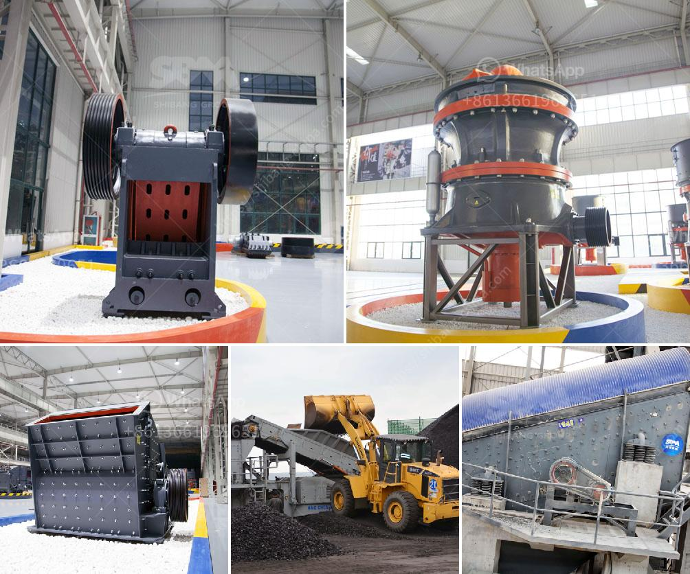

<h3>cost of conveyor belt system for coal loading</h3>
Conveyor belt systems are widely used in many industries for the continuous transportation of bulk materials, such as coal, ores, sand, and other raw materials. These systems are extremely efficient, reliable, and safe, making them a popular choice in the mining and manufacturing sectors.

When it comes to coal loading, conveyor belt systems play a crucial role in streamlining operations and reducing manual labor. They provide a cost-effective solution for transferring coal from the mining site to the storage area or directly to the transportation vessels.

The cost of a conveyor belt system for coal loading depends on several factors, including the length and width of the belt, the speed of operation, the power requirements, and the type of material being conveyed. Generally, larger systems with higher capacities will have higher costs, as they require more robust components and greater power consumption.

The price of the belt itself also varies depending on its quality, strength, and durability. Some belts are specifically designed for heavy-duty applications, with special materials and reinforced structures that can withstand the harsh conditions of coal loading. These high-quality belts may have a higher upfront cost but can provide a longer lifespan, reducing the need for frequent replacements.

Additionally, the installation and maintenance costs of the conveyor belt system should be taken into account. Proper installation by skilled technicians is crucial to ensure the system operates efficiently and safely. Regular inspections and maintenance routines are necessary to identify and address any potential issues before they escalate into costly repairs or downtime.

Despite the initial investment, a well-designed and properly maintained conveyor belt system can bring significant cost savings in the long run. It dramatically reduces labor costs, minimizes the risk of accidents or injuries associated with manual handling, and improves productivity by enabling a continuous flow of coal.

In conclusion, the cost of a conveyor belt system for coal loading can vary depending on various factors. It is crucial to consider the specific requirements of the operation and choose a system that offers the best balance between cost, performance, and durability. As coal remains a significant energy source worldwide, investing in conveyor belt systems can enhance the efficiency and profitability of coal handling processes.
<h3>Contact us</h3><ul><li><strong>Whatsapp:&nbsp;<a href="https://wa.me/8613661969651">+8613661969651</a></strong></li><li><a href="https://swt.shibang-china.com/?git&amp;zhl&amp;cost of conveyor belt system for coal loading"><strong>Online Service(chat now)</strong></a></li></ul><h3>Related</h3><ul><li><a href='crusher plant project cost.md'>crusher plant project cost</a></li><li><a href='vibrating screen manufacture in philippines.md'>vibrating screen manufacture in philippines</a></li><li><a href='slag grinding ball mill.md'>slag grinding ball mill</a></li><li><a href='vertical milling machine used for calcium carbonate.md'>vertical milling machine used for calcium carbonate</a></li><li><a href='cost of conveyor belt system for coal loading.md'>cost of conveyor belt system for coal loading</a></li></ul>