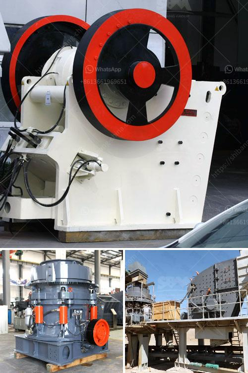

<h3>cost of crusher machine</h3>
When it comes to crushing materials, there is no denying that a stone crusher machine is an essential piece of machinery. However, the cost of owning and operating this equipment can be quite steep. As such, it’s important to consider all the factors before making a purchase decision.

One of the biggest considerations when purchasing a crusher machine is the initial cost. This includes the price of the machine itself, as well as any additional expenses such as installation and transportation. Depending on the size and capacity of the machine, the cost can range from several thousand dollars to millions of dollars. Therefore, it’s crucial to establish a budget and stick to it when searching for the right crusher machine.

The cost of operating a crusher machine goes beyond the initial purchase price. There are several ongoing expenses that need to be taken into account. The most significant expense is the cost of fuel or electricity required to run the machine. Additionally, regular maintenance and repairs can add up over time. It’s essential to factor in the cost of replacement parts, such as liners and hammers, which will eventually wear out and need to be replaced.

Another cost to consider is the amount of time and labor required to operate the crusher machine. Depending on the complexity of the machine, it may need a highly skilled operator to ensure smooth operation and maximum efficiency. Hiring skilled labor or training existing employees can add to the overall cost.

Furthermore, the location and accessibility of the site where the crusher machine will be used can affect costs. If the machine needs to be transported long distances or requires special permits to be moved, additional expenses will arise. Similarly, if the site is difficult to access or requires infrastructure improvements, the cost will increase.

Despite the high costs associated with owning and operating a crusher machine, it is often seen as a necessary investment for many industries. Crushers are used in the construction, mining, and aggregate industries to break down larger rocks and stones into smaller, more manageable pieces. This allows for easier transportation and processing of materials, ultimately saving time and money in the long run.

The cost of a crusher machine should be justified by the benefits it provides. These can include increased productivity and efficiency, enhanced safety, and the ability to process a wider range of materials. It’s important to consider the specific needs and requirements of your industry before purchasing a machine.

In conclusion, the cost of owning and operating a crusher machine can be significant. It’s crucial to carefully evaluate the initial purchase price, ongoing expenses, labor costs, and site accessibility. However, when used in the right industry and under the appropriate circumstances, a crusher machine can greatly improve productivity and overall efficiency, making it a worthwhile investment.
<h3>Contact us</h3><ul><li><strong>Whatsapp:&nbsp;<a href="https://wa.me/8613661969651">+8613661969651</a></strong></li><li><a href="https://swt.shibang-china.com/?git&amp;zhl&amp;cost of crusher machine"><strong>Online Service(chat now)</strong></a></li></ul><h3>Related</h3><ul><li><a href='stone crusher plant video.md'>stone crusher plant video</a></li><li><a href='distributor of crushing machines in malaysia.md'>distributor of crushing machines in malaysia</a></li><li><a href='mobile copper concentrate machine.md'>mobile copper concentrate machine</a></li><li><a href='price 100 tph crusher plant.md'>price 100 tph crusher plant</a></li><li><a href='cost of a jaw crusher in india.md'>cost of a jaw crusher in india</a></li></ul>