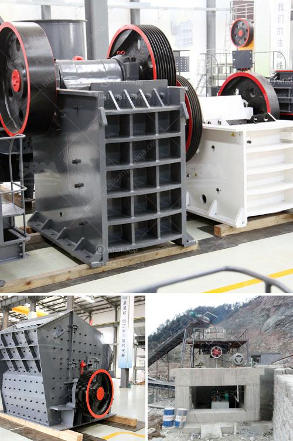

<h3>cost of crusher run in las vegas</h3>
The cost of crusher run in Las Vegas may vary depending on the quantity and quality of the material being sold. While crusher run is often used as a base layer in construction projects, it can also be used for driveways and paths. In this article, we will explore the cost of crusher run in Las Vegas and provide some tips on how to save money on this type of material.

Crusher run is a type of gravel that consists of angular, crushed rock ranging in size from 3/4-inch to silt. It is commonly used as a base layer for roads, driveways, and parking lots because it provides stability and drainage. The crushed rock binds together when compacted and creates a solid surface that can withstand heavy traffic.

When it comes to the cost of crusher run in Las Vegas, there are several factors that can influence the price. The first factor is the quantity of material needed. Generally, the more crusher run you need, the lower the cost per ton. However, it is important to note that there may be a minimum quantity requirement when purchasing crusher run from a supplier.

The second factor that can affect the cost of crusher run is the quality of the material. High-quality crusher run often costs more than lower-quality materials because it has been processed and screened to remove debris and other impurities. This ensures that the material is uniform and of consistent quality.

In Las Vegas, the average cost of crusher run ranges from $30 to $50 per ton, depending on the quantity and quality of the material. Some suppliers may charge additional fees for delivery, so it is important to ask about these fees when obtaining quotes.

To save money on crusher run in Las Vegas, there are a few tips you can follow. First, consider purchasing the material in bulk. Many suppliers offer discounts for large quantities, so buying in bulk can help reduce the overall cost. Additionally, purchasing crusher run from a local supplier can save money on delivery fees.

Another way to save money on crusher run is to compare prices from different suppliers. Take the time to research and obtain quotes from several suppliers in the Las Vegas area. This will allow you to compare prices and find the best deal for your specific needs.

Ultimately, the cost of crusher run in Las Vegas can vary depending on the quantity and quality of the material, as well as additional fees for delivery. By purchasing in bulk, comparing prices, and working with a local supplier, you can save money on this essential construction material. Whether you are building a road, driveway, or path, crusher run provides the stability and drainage needed for a durable surface.
<h3>Contact us</h3><ul><li><strong>Whatsapp:&nbsp;<a href="https://wa.me/8613661969651">+8613661969651</a></strong></li><li><a href="https://swt.shibang-china.com/?git&amp;zhl&amp;cost of crusher run in las vegas"><strong>Online Service(chat now)</strong></a></li></ul><h3>Related</h3><ul><li><a href='quotation for iron ore processing.md'>quotation for iron ore processing</a></li><li><a href='nigeria minerals crusher processing company.md'>nigeria minerals crusher processing company</a></li><li><a href='impact crusher dealer.md'>impact crusher dealer</a></li><li><a href='stone quarry crusher companies in ghana.md'>stone quarry crusher companies in ghana</a></li><li><a href='price of mobile crusher.md'>price of mobile crusher</a></li></ul>