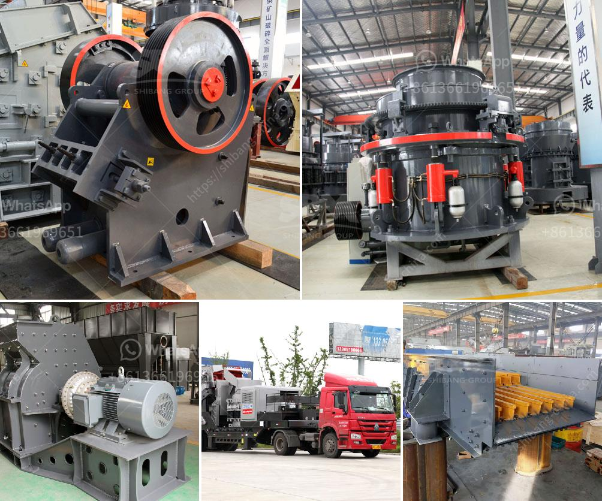

<h3>cost of graphite processing plant</h3>
Graphite is a versatile mineral used in various industries, including batteries, lubricants, refractories, and foundries. As demand for these products continues to rise, the establishment of graphite processing plants becomes a crucial factor in ensuring a steady supply and reducing dependence on imports. However, setting up such a facility requires significant investment, and understanding the associated costs is essential for successful project planning.

The cost of establishing a graphite processing plant can vary depending on several factors, including the plant's capacity, location, and the technology employed. In general, larger plants with higher production capacities require more substantial investments. On average, a plant with a production capacity of around 10,000 to 20,000 metric tons per year may require an initial investment of approximately $10-20 million.

One of the most significant cost factors is the plant's location. The availability of raw materials, proximity to key markets, and infrastructure accessibility all influence the overall costs. A plant located near graphite mines can significantly reduce transportation costs, as well as enable the utilization of local labor and resources. Conversely, establishing a plant in a remote area or importing raw materials can increase expenses associated with transportation and logistics.

Another crucial aspect to consider is the technology employed for processing graphite. The choice of technology depends on the desired end products and the quality requirements. Conventional processing methods involve steps such as crushing, grinding, flotation, and purification. Advanced technologies such as thermal purification and chemical exfoliation may offer better quality output but can increase the initial investment. Therefore, it is essential to balance the desired quality of the graphite products with the available budget.

In addition to the initial investment, ongoing operational costs should also be considered. These costs include labor, energy, maintenance, and administrative expenses. Labor costs can vary depending on the plant's location and labor market conditions. Energy costs are influenced by the efficiency of equipment and the choice of energy sources. Furthermore, maintenance expenses are crucial to ensure the smooth operation of the plant and prevent any costly breakdowns or delays.

Governments and financial institutions recognize the importance of graphite processing plants for local economies and may provide various incentives and funding options to support such projects. It is crucial to research and leverage these opportunities when planning the establishment of a graphite processing plant. Government grants, tax breaks, and low-interest loans can significantly reduce the initial investment and help accelerate the project's implementation.

Furthermore, collaboration with partners and investors can also alleviate the financial burden. Joint ventures or partnerships with graphite mining companies or technology providers can provide access to capital, expertise, and existing infrastructure. These collaborations can reduce the overall project costs and enable a more efficient and timely establishment of the plant.

In conclusion, establishing a graphite processing plant requires a significant investment, which can vary depending on factors such as plant capacity, location, and technology employed. The costs associated with setting up and operating the plant should be carefully assessed and balanced with the desired quality of the end products. Additionally, exploring financial incentives, partnerships, and collaborations can help reduce the initial investment and accelerate the project implementation. As demand for graphite products continues to grow, the establishment of processing plants plays a vital role in ensuring a steady supply and supporting local economies.
<h3>Contact us</h3><ul><li><strong>Whatsapp:&nbsp;<a href="https://wa.me/8613661969651">+8613661969651</a></strong></li><li><a href="https://swt.shibang-china.com/?git&amp;zhl&amp;cost of graphite processing plant"><strong>Online Service(chat now)</strong></a></li></ul><h3>Related</h3><ul><li><a href='gypsum making machine.md'>gypsum making machine</a></li><li><a href='nigeria mobile crusher.md'>nigeria mobile crusher</a></li><li><a href='hammer mill mesin impor china.md'>hammer mill mesin impor china</a></li><li><a href='process of making diamonds from coal.md'>process of making diamonds from coal</a></li><li><a href='processing of zirconium sand milling.md'>processing of zirconium sand milling</a></li></ul>