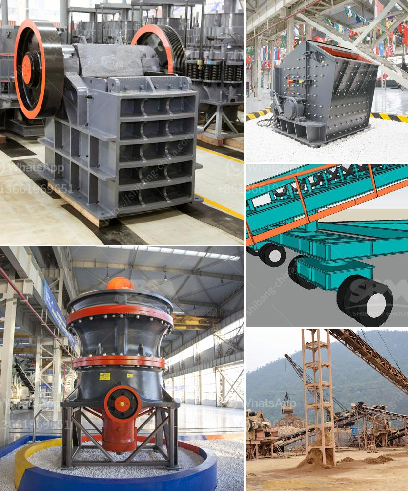

<h3>cost of hammer mill</h3>
The cost of a hammer mill can vary greatly depending on the size, brand, and capacity. The type and quality of materials used along with the craftsmanship also play a significant role in determining the final price.

A hammer mill is a machine used for crushing and grinding various materials into smaller pieces. The size and configuration of the hammer mill can vary greatly depending on the intended purpose. The cost of purchasing a hammer mill usually ranges from several hundred to several thousand dollars. This cost will depend on factors such as size, brand, and capacity.

Size is an essential factor in determining the cost of a hammer mill. Generally, larger machines with greater capacity will cost more than smaller ones. Prices can also vary depending on the level of automation included in the mill. Machines that require more manual labor to operate or those with more advanced features may be priced higher.

The brand of the hammer mill can also have a significant impact on its cost. Some well-known and reputable brands may be priced higher due to their established reputation and reliability. However, cheaper options may also be available from lesser-known brands, although the quality and durability of these machines could be questionable.

Apart from the size and brand, the quality of materials used in the construction of the hammer mill can also affect its price. A sturdier and more durable machine, made with high-quality materials, will typically cost more than a flimsy, less reliable model. Investing in a higher-quality hammer mill can potentially save money in the long run by lasting longer and requiring less maintenance.

Craftsmanship plays a crucial role in the cost of a hammer mill. Attention to detail and the level of expertise put into the manufacturing process can influence the price. Higher-quality mills typically involve meticulous craftsmanship, resulting in a costlier end product.

When considering the cost of a hammer mill, it is essential to assess the specific requirements of the user. The desired capacity, the type of materials to be processed, and the desired end product will determine the appropriate size and specifications for the machine. It is advisable to consult with a knowledgeable professional who can provide guidance on the most cost-effective options for specific needs.

Additionally, it is worth considering the long-term benefits of investing in a hammer mill. While a higher-quality and more expensive machine may initially be more costly, it can offer improved performance and durability, potentially leading to higher efficiency and reduced maintenance costs in the long run.

In conclusion, the cost of a hammer mill can vary greatly depending on factors such as size, brand, capacity, the quality of materials used, and craftsmanship. It is crucial to consider the specific requirements and long-term benefits when assessing the value and affordability of a hammer mill.
<h3>Contact us</h3><ul><li><strong>Whatsapp:&nbsp;<a href="https://wa.me/8613661969651">+8613661969651</a></strong></li><li><a href="https://swt.shibang-china.com/?git&amp;zhl&amp;cost of hammer mill"><strong>Online Service(chat now)</strong></a></li></ul><h3>Related</h3><ul><li><a href='quartz grits plant consultancy.md'>quartz grits plant consultancy</a></li><li><a href='calcium carbonate in kenya.md'>calcium carbonate in kenya</a></li><li><a href='small scale cement plants in india.md'>small scale cement plants in india</a></li><li><a href='hammer crusher hammer balancing chart.md'>hammer crusher hammer balancing chart</a></li><li><a href='limestone manufacturer supplier egypt.md'>limestone manufacturer supplier egypt</a></li></ul>