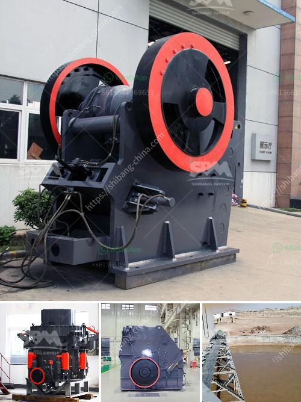

<h3>cost of lime stone crusher plant</h3>
The demand for lime stone is always high due to its extensive use in construction industries. With the entrepreneur's intention to set up a lime stone crushing plant, a huge investment is required. To avail this valuable mineral resource, mining and extraction of lime stone is a crucial process.

Firstly, large lime stones are extracted from the quarries and they undergo primary and secondary crushing processes to obtain desired sizes. The stone crushers are highly necessary for the mining process since they can break down the huge rocks into smaller chunks with ease. The cost of a lime stone crusher plant can vary widely based on various factors. These include the plant's capacity, the required sizes of the crushed lime stone, the setting adjustments of the crusher, and other associated costs.

Considering the cost involved in setting up a lime stone crusher plant, it is important to understand the various aspects utilizing which funds can be saved. Firstly, selecting the appropriate location for the plant plays a significant role. The site location should be such that it reduces transportation costs for both input materials and the final product. Secondly, using energy-efficient machinery can help in reducing power consumption and thereby lowering energy costs. Additionally, opting for used crushing equipment instead of new ones can significantly reduce the initial capital expenditure.

Furthermore, obtaining the required permits and adhering to the regulatory guidelines is vital. Any delays or compliance issues due to non-compliance can lead to additional costs, fines, or even shutdowns. Hence, it is crucial to factor in potential legal costs and ensure all necessary documentation and permissions are in place during the planning and implementation phase.

In conclusion, the cost of setting up a lime stone crusher plant can vary based on numerous factors, including the capacity, size requirements, and regulatory compliance. However, by carefully considering the site location, energy efficiency, and opting for cost-effective machinery, entrepreneurs can reduce initial capital expenditure and long-term operational costs. Taking into account all these considerations, investing in a lime stone crusher plant has proven to be a lucrative venture with a high potential for returns.
<h3>Contact us</h3><ul><li><strong>Whatsapp:&nbsp;<a href="https://wa.me/8613661969651">+8613661969651</a></strong></li><li><a href="https://swt.shibang-china.com/?git&amp;zhl&amp;cost of lime stone crusher plant"><strong>Online Service(chat now)</strong></a></li></ul><h3>Related</h3><ul><li><a href='rock quarry crusher equipment.md'>rock quarry crusher equipment</a></li><li><a href='design drawings of a hammer mill.md'>design drawings of a hammer mill</a></li><li><a href='cement manufacturing equipment pdf.md'>cement manufacturing equipment pdf</a></li><li><a href='cement making machinery for whole cement plant.md'>cement making machinery for whole cement plant</a></li><li><a href='conveyor belt hangzhou.md'>conveyor belt hangzhou</a></li></ul>