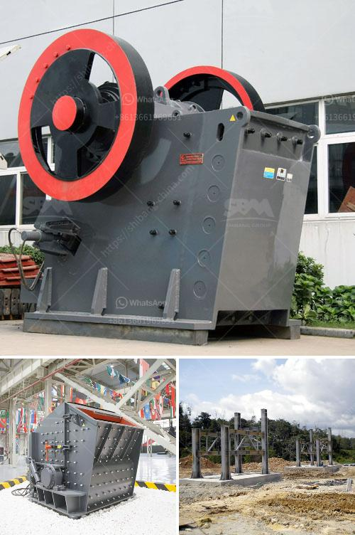

<h3>cost of setting up cement plant per mtpa</h3>
The cost of setting up a cement plant varies depending on factors such as the location, size, and scale of the plant. The cost of the plant will also depend on the raw materials and the methods of production used. In this article, we will discuss the estimated cost of setting up a cement plant per metric tonne per annum (MTPA).

The first factor to consider when setting up a cement plant is the location. The cost of land and infrastructure will vary depending on the location. If the plant is set up in a remote area, the cost of acquiring land and building infrastructure such as roads, electricity, and water supply may increase the overall cost of setting up the plant. On the other hand, if the plant is set up near the source of raw materials, it may reduce transportation costs and make the project more cost-effective.

Another important factor to consider is the size and scale of the plant. A larger plant with a higher production capacity will require a higher investment compared to a smaller plant. The size and scale of the plant will depend on factors such as the demand for cement in the region, the availability of raw materials, and the competition in the market. Before deciding on the size of the plant, a detailed market analysis needs to be carried out to assess the demand and competition in the region.

The raw materials used in cement production also impact the cost of setting up a cement plant. The main raw materials required for cement production are limestone, clay, iron ore, and gypsum. The cost of acquiring these raw materials can vary depending on factors such as proximity to the plant, transportation costs, and availability in the region. It is crucial to conduct a feasibility study to assess the availability of these raw materials and their associated costs.

The methods of production used can also significantly impact the cost of setting up a cement plant. There are various production technologies available, such as the dry process and the wet process. The choice of technology will depend on factors such as the quality of raw materials, energy efficiency, and environmental impact. Advanced production technologies may require a higher initial investment but can result in lower operational costs over the long term.

Considering all these factors, the estimated cost of setting up a cement plant per MTPA can range from USD 50 to USD 150, depending on the specific circumstances. It's important to note that these figures are approximate and can vary widely depending on the individual project. Developing a detailed project plan and conducting a thorough feasibility study will provide a more accurate estimate of the cost involved.

In conclusion, setting up a cement plant involves various factors that contribute to the overall cost. The location, size, and scale of the plant, as well as the raw materials and production methods used, all impact the investment required. Conducting a detailed feasibility study and market analysis will help determine the actual cost of setting up a cement plant per MTPA and ensure a successful and cost-effective project.
<h3>Contact us</h3><ul><li><strong>Whatsapp:&nbsp;<a href="https://wa.me/8613661969651">+8613661969651</a></strong></li><li><a href="https://swt.shibang-china.com/?git&amp;zhl&amp;cost of setting up cement plant per mtpa"><strong>Online Service(chat now)</strong></a></li></ul><h3>Related</h3><ul><li><a href='crusher plant in sri lanka.md'>crusher plant in sri lanka</a></li><li><a href='ball mill gypsum.md'>ball mill gypsum</a></li><li><a href='mini cement plants manufacturer africa.md'>mini cement plants manufacturer africa</a></li><li><a href='iron processing machine.md'>iron processing machine</a></li><li><a href='mobile sand making machine.md'>mobile sand making machine</a></li></ul>