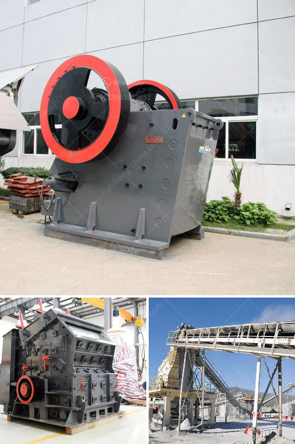

<h3>cost of stone crusher</h3>
The cost of stone crusher has always been a significant issue for customers, both at home and abroad. With the increasing demand for stone crusher, the manufacturers are constantly working hard to improve the quality and increase the production efficiency. Now we will introduce the cost of stone crusher.

There are two main types of stone crusher. One is a single-stage crusher, the other is a multi-stage crusher. The difference between the two types of stone crusher is that the feeding size of the first type is much smaller than the discharging size, so the crushing process is more complex and the price is naturally higher. While the multi-stage crusher has simpler operation procedures and lower price.

The investment cost of a stone crusher varies greatly depending on the power, equipment and capacity needed. For example, the crushers with a capacity of 200 tons per hour have the highest investment. However, it will only take one extra hour to process 200 tons of granite with the same capacity of 250 tons/hour. Therefore, the investment cost of the equipment is justified.

In addition to the equipment cost, the price of stone crusher also includes the transportation cost, installation cost, maintenance and repair cost, as well as other miscellaneous costs such as ecologically friendly equipment and energy saving equipment. These factors must be taken into account when calculating the overall cost of the stone crusher.

To sum up, the cost of stone crusher should be considered from several aspects, such as the investment cost, operating cost, and maintenance cost, etc. It is suggested that customers should conduct a comprehensive analysis of these factors and compare various crusher manufacturers before making a decision. Only by doing so can they choose the most cost-effective equipment and maximize their benefits.
<h3>Contact us</h3><ul><li><strong>Whatsapp:&nbsp;<a href="https://wa.me/8613661969651">+8613661969651</a></strong></li><li><a href="https://swt.shibang-china.com/?git&amp;zhl&amp;cost of stone crusher"><strong>Online Service(chat now)</strong></a></li></ul><h3>Related</h3><ul><li><a href='japan crushing machine manufacturers list.md'>japan crushing machine manufacturers list</a></li><li><a href='second hand sand making machine cost.md'>second hand sand making machine cost</a></li><li><a href='process of crushing stones.md'>process of crushing stones</a></li><li><a href='copper mining process.md'>copper mining process</a></li><li><a href='ecotec line for grinding of calcium carbonate.md'>ecotec line for grinding of calcium carbonate</a></li></ul>