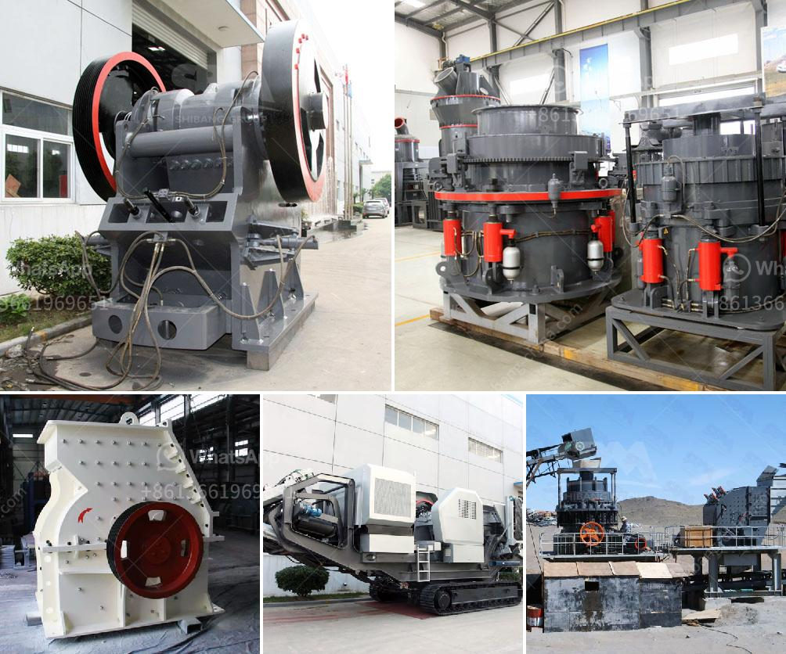

<h3>cost per ton quarry production</h3>
Cost per ton quarry production refers to the monetary expenses incurred when extracting and processing rock, stone, sand, and gravel from a quarry. It is often referred to as the production cost, which includes costs for drilling, blasting, loading, hauling, crushing, and screening. Quarry production costs vary widely depending on the rock type, equipment efficiency, and operational conditions.

To calculate the cost per ton, a typical formula is used, which includes the fixed and variable costs associated with quarry operations. Fixed costs include expenses related to equipment purchase or lease, finance charges, and insurance, while variable costs include fuel, lubricants, maintenance, and repairs. Additionally, labor costs for the workers directly involved in the production process must also be considered.

The productivity and efficiency of quarry operations play a crucial role in determining the cost per ton. Advanced technologies and equipment can improve efficiency and reduce overall costs. For example, sophisticated drilling and blasting techniques minimize wastage and improve fragmentation, resulting in reduced energy consumption during crushing and screening. Furthermore, efficient haulage and loading practices can enhance productivity and reduce fuel consumption.

Proper planning and execution of maintenance activities are vital for controlling costs. Failing to maintain and proactively repair equipment can lead to breakdowns, increased downtime, and higher repair costs. Regular monitoring of fuel consumption and implementing measures to optimize fuel usage can also contribute to cost reduction.

It is important for quarry operators to track and analyze their cost per ton figures regularly to identify areas for improvements and optimize their operations. Benchmarking against industry standards can help evaluate performance and identify areas for cost-saving measures. Effective management of all operational variables, such as material type, environmental factors, and workforce efficiency, is critical to maximizing production while minimizing costs.

In conclusion, the cost per ton quarry production is a comprehensive indicator that captures various aspects of quarry operations. Striving for efficiency, maintaining equipment, minimizing energy consumption, and optimizing workforce productivity are some of the key factors that can help reduce costs and increase profitability for quarry operators.
<h3>Contact us</h3><ul><li><strong>Whatsapp:&nbsp;<a href="https://wa.me/8613661969651">+8613661969651</a></strong></li><li><a href="https://swt.shibang-china.com/?git&amp;zhl&amp;cost per ton quarry production"><strong>Online Service(chat now)</strong></a></li></ul><h3>Related</h3><ul><li><a href='hydraulic cone crusher.md'>hydraulic cone crusher</a></li><li><a href='small sand washing machine.md'>small sand washing machine</a></li><li><a href='coal washing plant cost.md'>coal washing plant cost</a></li><li><a href='america stone crusher price.md'>america stone crusher price</a></li><li><a href='milling equipment ball mill.md'>milling equipment ball mill</a></li></ul>