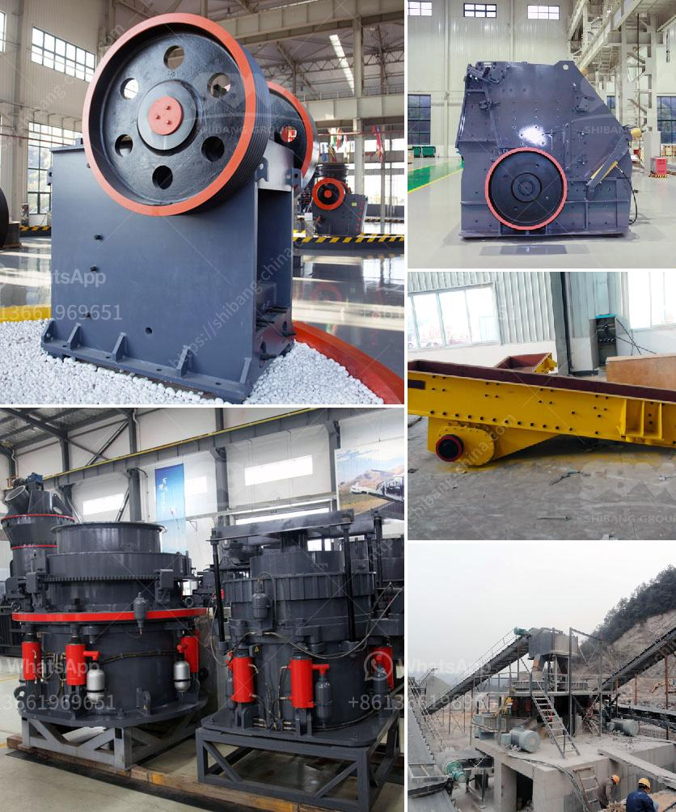

<h3>costs of ball mills</h3>
Ball mills are a fundamental part of the manufacturing industry in the USA as well as around the world. Ball mills crush material into various sizes and extract resources from mined materials. Pebble mills are a type of ball mill and are also used to reduce the size of hard materials, down to 1 micron or less.

Since its inception, ball milling has undergone several technological advancements, making it a reliable and cost-effective method for particle size reduction and material processing. However, the costs associated with ball mills can vary widely depending on factors such as the technology being used, the size of the mill, and the desired product output.

One important factor determining the cost of a ball mill is its size. Biggers mills are typically more expensive due to their ability to process more material at a higher throughput rate. Smaller mills, on the other hand, are generally more cost-effective for smaller-scale operations or when the desired output is not as high.

Another crucial factor affecting the cost of ball mills is the technology being used. Traditional ball mills use a rotating drum to grind and blend materials, but newer technology has introduced several variations. High-energy ball mills, for example, utilize impact and friction forces to reduce particle size and achieve finer powders. While these mills may have a higher upfront cost, they often offer operational and energy efficiency advantages that can outweigh the initial investment.

Additionally, the type of material being processed can impact the cost of ball mills. Some materials require more intensive milling processes, which can result in higher costs due to increased wear on the mill and the need for additional maintenance. It's essential to consider these factors when selecting the appropriate mill for a specific application.

Maintenance and operational expenses are additional factors to consider when estimating the total cost of a ball mill. Regular maintenance is crucial to ensuring the longevity and efficiency of the mill. Proper lubrication, cleaning, and inspection can help prevent breakdowns and reduce downtime. Moreover, operational expenses such as energy consumption and labor costs should be taken into account when calculating the overall costs.

Lastly, it is worth mentioning that while the initial investment for a ball mill may seem high, the long-term savings can outweigh the upfront costs. The efficiency and reliability of ball mills can lead to cost savings through higher production rates, reduced downtime, and better product quality.

In conclusion, the cost of ball mills can vary based on factors such as size, technology, material being processed, and maintenance requirements. The benefits of investing in a high-quality ball mill that meets the specific needs of an operation can far outweigh the initial investment, leading to long-term cost savings and improved productivity.
<h3>Contact us</h3><ul><li><strong>Whatsapp:&nbsp;<a href="https://wa.me/8613661969651">+8613661969651</a></strong></li><li><a href="https://swt.shibang-china.com/?git&amp;zhl&amp;costs of ball mills"><strong>Online Service(chat now)</strong></a></li></ul><h3>Related</h3><ul><li><a href='river sand washed machine.md'>river sand washed machine</a></li><li><a href='feldspar crusher cost.md'>feldspar crusher cost</a></li><li><a href='stone crusher for sale price in dubai.md'>stone crusher for sale price in dubai</a></li><li><a href='limestone crusher kenya.md'>limestone crusher kenya</a></li><li><a href='stone crusher plant video.md'>stone crusher plant video</a></li></ul>