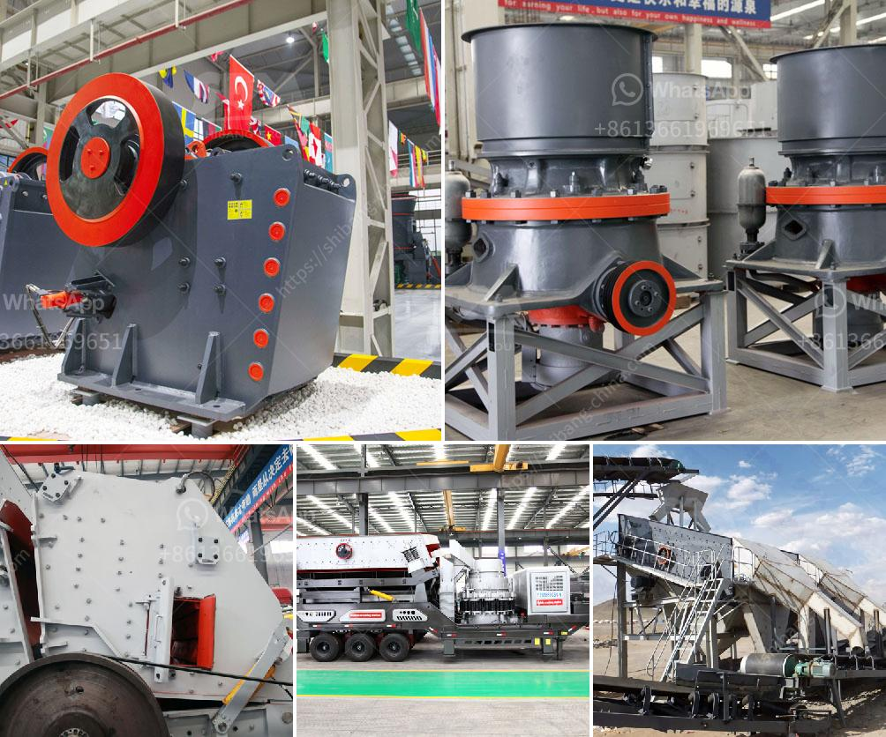

<h3>crawler type mobile crusher plant</h3>
Crawler type mobile crusher plant is an efficient and low-cost crushing equipment, which adopts self-driving method, advanced technology and complete functions. Under any terrain conditions, the equipment can reach any location of the working site in order to carry out the crushing operation. This can reduce the operation and operation cost of the equipment to a large extent.

The crawler type mobile crusher plant is equipped with a high-performance jaw crusher and a vertical shaft impact crusher. There are eight types of jaw crushers and four types of vertical shaft impact crushers for client to choose from. The PEW and HJ series jaw crushers adopt the world's most advanced crushing technology and manufacturing level, which are suitable for crushing hard materials or various ores and rocks.

The crawler type mobile crusher plant is equipped with a vibrating feeder and a vibrating screen. The vibrating feeder can feed materials directly to the crushers without preliminary screening. It can remove the soil and fine particles in advance and improve the crushing efficiency. The vibrating screen is equipped with an automatic screening system, which can screen materials accurately and effectively. The screened materials can be separated according to their specifications into different piles and transported separately, reducing the transportation cost and improving the utilization rate of materials.

The crawler type mobile crusher plant is equipped with an intelligent operating system, which can realize the continuous and automatic operation of the equipment. It can track and control the crushing process in real time, and automatically adjust the equipment parameters according to the actual working conditions, so as to achieve the best crushing effect. It also has a remote control system, which can remotely monitor the operation of the equipment and easily deal with any abnormal situations.

The crawler type mobile crusher plant is compact in structure and easy to transport. It can be divided into four modules: feeding, crushing, screening and conveying. Each module can be configured separately or in combination according to the actual needs of clients. The equipment can be directly driven to the working site without disassembly, which greatly saves the transportation time and cost.

In summary, the crawler type mobile crusher plant is a high-efficiency, low-cost crushing equipment that can move at any time and work flexibly in any environment. It adopts self-driving method and advanced technology, and complete functions. It has many advantages such as high crushing efficiency, low maintenance cost, small floor space, convenient installation and maintenance, etc., which has been widely used in various industries such as mining, construction, building materials, highways, railways, water conservancy and chemical industry. With the continuous development of technology, the crawler type mobile crusher plant will surely bring more convenience and benefits to the crushing industry.
<h3>Contact us</h3><ul><li><strong>Whatsapp:&nbsp;<a href="https://wa.me/8613661969651">+8613661969651</a></strong></li><li><a href="https://swt.shibang-china.com/?git&amp;zhl&amp;crawler type mobile crusher plant"><strong>Online Service(chat now)</strong></a></li></ul><h3>Related</h3><ul><li><a href='sand screens and sieves dealers contacts.md'>sand screens and sieves dealers contacts</a></li><li><a href='singapore mining conveyor belt supplier.md'>singapore mining conveyor belt supplier</a></li><li><a href='belt cost conveyor.md'>belt cost conveyor</a></li><li><a href='limestone mining process.md'>limestone mining process</a></li><li><a href='quote for stone crusher.md'>quote for stone crusher</a></li></ul>