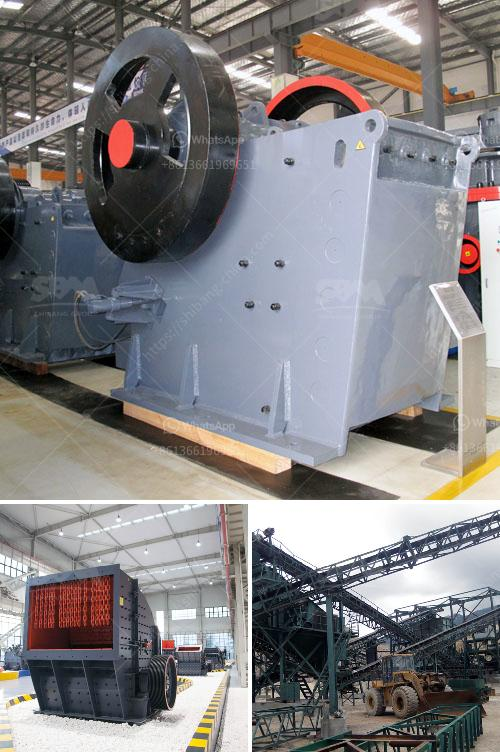

<h3>crush granite to powder</h3>
Granite, a wildly popular rock formation used in construction and interior design, has gained attention for its durability, versatility, and visual appeal. With its unique patterns and color variations, granite has become a staple material for countertops, flooring, and various other building applications. However, the extraction and processing of granite can have environmental implications, which has sparked interest in innovative ways to recycle and repurpose this natural resource. One pioneering approach gaining momentum is crushing granite into powder, opening up new possibilities for sustainable infrastructure.

The process of crushing granite into powder involves breaking the rock into smaller pieces, reducing its size and volume. By pulverizing granite, it becomes easier to transport, store, and repurpose as needed. Moreover, crushing granite to powder can yield several benefits from both an environmental and economic perspective.

Firstly, the extraction of granite, like many other natural stones, involves quarrying, which can cause significant environmental damage. Quarrying operations lead to deforestation, habitat destruction, and soil erosion. By recycling and reusing granite waste through the crushing process, we reduce the need for fresh quarrying, preserving natural resources and minimizing these detrimental impacts.

Secondly, crushing granite into powder can address the challenges associated with storing and transporting this bulky material. Granite, in its original form, requires large surface areas to store and consumes significant space during transportation. However, by breaking it down into powder, the volume reduces substantially, allowing for more efficient storage and shipping. This reduction in space requirements leads to reduced transportation costs, decreased energy consumption, and lower carbon emissions associated with logistics.

Furthermore, the repurposing of crushed granite powder presents several opportunities in sustainable infrastructure development. For instance, the powder can be used as a filler in concrete production, reducing the need for Portland cement, a significant contributor to carbon emissions. Adding granite powder to the concrete mix enhances its strength, durability, and resistance to various environmental factors, making it an ideal choice for constructing long-lasting and sustainable buildings.

Moreover, the use of crushed granite powder can also benefit road construction and maintenance. Mixing the powder with bitumen to create asphalt offers benefits such as increased road longevity, improved skid resistance, and reduced noise pollution. Furthermore, the powder's thermal properties can contribute to decreased temperature differentials in the road surface, thus reducing wear and tear due to thermal expansion and contraction.

Additionally, granite powder can be utilized in the production of tiles, mosaics, and various decorative applications. Mixing the powder with binders can create a versatile material suitable for interior and exterior design, providing a visually appealing and sustainable alternative to traditional materials.

In conclusion, crushing granite into powder presents an innovative and sustainable solution in the construction industry. By diverting waste from landfills, minimizing environmental damage, and improving material efficiency, this process contributes to the development of a circular economy. Repurposing granite waste offers numerous economic and environmental advantages, including reduced transportation costs, lower carbon emissions, enhanced material properties, and the creation of visually stunning sustainable infrastructure. As we strive for a greener future, the exploration of novel methods, such as crushing granite to powder, paves the way for a more sustainable and responsible construction industry.
<h3>Contact us</h3><ul><li><strong>Whatsapp:&nbsp;<a href="https://wa.me/8613661969651">+8613661969651</a></strong></li><li><a href="https://swt.shibang-china.com/?git&amp;zhl&amp;crush granite to powder"><strong>Online Service(chat now)</strong></a></li></ul><h3>Related</h3><ul><li><a href='conveyor belts nigeria.md'>conveyor belts nigeria</a></li><li><a href='wet ball milling vs dry ball milling.md'>wet ball milling vs dry ball milling</a></li><li><a href='stone crushers in malaysia.md'>stone crushers in malaysia</a></li><li><a href='how to make a vibrating shaft for vibrating screens.md'>how to make a vibrating shaft for vibrating screens</a></li><li><a href='crusher stone sand making stone quarry.md'>crusher stone sand making stone quarry</a></li></ul>