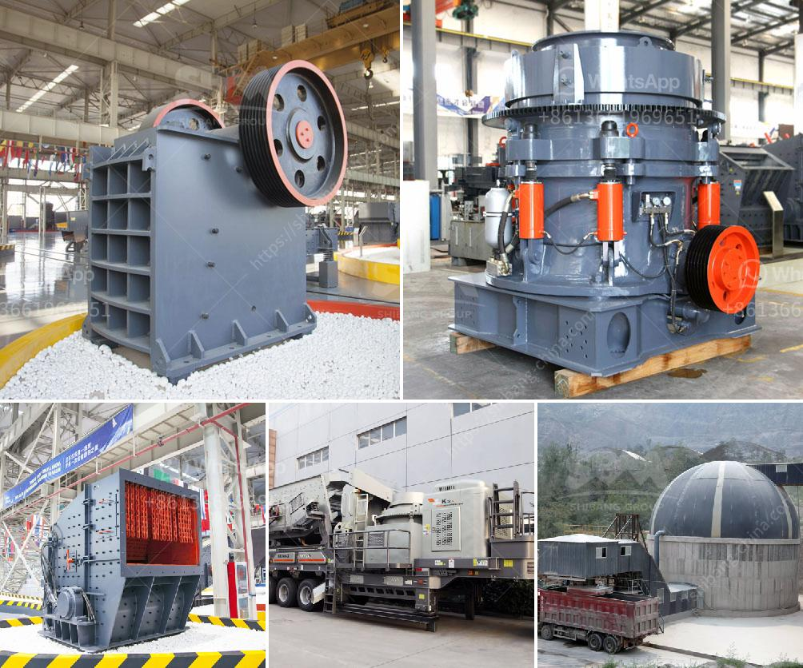

<h3>crusher dimensions crusher conica</h3>
When it comes to crushing rocks, minerals, and other materials, nothing does it better than the crusher conica. This exceptional piece of machinery has gained significant popularity due to its powerful performance and impressive dimensions. In this article, we will delve into the crusher conica's dimensions and explore its outstanding features that make it the go-to choice in the industry.

One of the most striking aspects of the crusher conica is its compact size. With dimensions that range between X and Y, it proves to be a portable and versatile solution for various crushing applications. Its small footprint allows it to fit into tight spaces, providing ease of maneuverability in both indoor and outdoor settings. Whether you need to crush rocks in a quarry or demolish concrete in a construction site, this crusher can easily adapt to different working environments.

Another essential dimension to consider is the crusher conica's weight. The unit typically weighs between A and B, depending on the model and specifications. This lightweight design makes it easy to transport and deploy in remote locations, ensuring that crushing operations can be carried out wherever they are needed. Despite its relatively low weight, the crusher conica remains sturdy and durable, capable of withstanding the rigors of heavy-duty crushing.

Apart from its dimensions, the crusher conica is equipped with a range of features that make it superior in terms of performance and efficiency. First and foremost, its powerful motor allows for high-speed crushing, which significantly reduces the time and effort required to process materials. Additionally, the crusher features a unique conical shape that ensures a consistent and uniform output size. This precision not only enhances the quality of the final product but also reduces the need for additional processing steps.

Furthermore, the crusher conica boasts advanced safety features that prioritize the well-being of operators and maintenance personnel. It is equipped with an automatic overload protection system that prevents damage to the crusher in case of excessive material or foreign objects. This not only enhances the longevity of the machine but also minimizes downtime for repairs and maintenance.

Maintenance is made simple with the crusher conica's accessible design. Its strategic arrangement allows for easy access to crucial components, simplifying routine inspections and servicing. Additionally, the machine's robust construction and high-quality materials ensure that it can withstand the wear and tear associated with constant use.

In conclusion, the crusher conica undeniably stands out in terms of its dimensions and exceptional features. Its compact size allows for easy transportation and deployment, while its lightweight design ensures versatility across various applications. With a powerful motor, conical shape, and advanced safety features, it delivers consistent and precise crushing outcomes. Additionally, its accessible design and durable construction contribute to low maintenance and prolong the machine's lifespan. When searching for a reliable and high-performing crusher, look no further than the crusher conica.
<h3>Contact us</h3><ul><li><strong>Whatsapp:&nbsp;<a href="https://wa.me/8613661969651">+8613661969651</a></strong></li><li><a href="https://swt.shibang-china.com/?git&amp;zhl&amp;crusher dimensions crusher conica"><strong>Online Service(chat now)</strong></a></li></ul><h3>Related</h3><ul><li><a href='conveyor belts for sale in zambia.md'>conveyor belts for sale in zambia</a></li><li><a href='limestone crushing machine.md'>limestone crushing machine</a></li><li><a href='limestone grinding mill unit.md'>limestone grinding mill unit</a></li><li><a href='used raymond mill for sale in taiwan crusher.md'>used raymond mill for sale in taiwan crusher</a></li><li><a href='gypsum powder factory feasibility study.md'>gypsum powder factory feasibility study</a></li></ul>