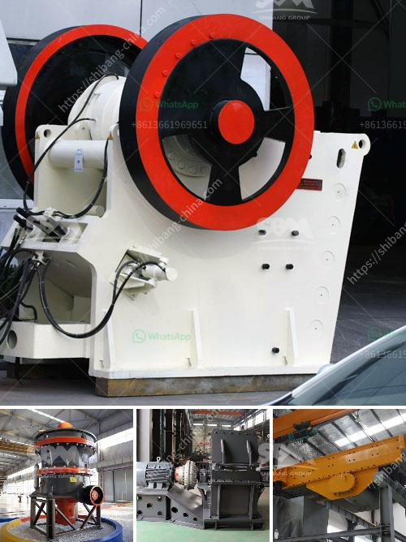

<h3>crusher equipment in sweden</h3>
Crusher equipment in Sweden plays a crucial role in many different industries. As the name suggests, it crushes large rocks and stones into smaller pieces for further processing or use. This equipment is commonly used in construction, mining, and recycling industries, among others.

Sweden is known for its rich mineral resources, making the mining industry a significant part of the country's economy. With the help of crushers, various minerals such as copper, nickel, and iron ore are extracted from the ground. These minerals are then refined and used in the manufacturing of various products worldwide.

In the construction sector, crushers are used to break down large rocks and stones into smaller sizes to create gravel and aggregates. These materials are essential for building roads, houses, and infrastructure projects. The Swedish crusher equipment ensures the efficiency and productivity of the construction process, ultimately contributing to the development of the country's infrastructure.

Furthermore, recycling is another important aspect where crusher equipment in Sweden comes into play. Sweden is known for its sustainable and eco-friendly practices, and recycling is a prime example. Crushers are used to crush and repurpose waste materials such as concrete and asphalt, reducing the environmental impact and carbon footprint. The recycled materials can be used as a base for roads and other construction projects, minimizing the need for virgin resources.

The crusher equipment in Sweden is designed to handle even the toughest applications, ensuring high efficiency and durability. Swedish manufacturers prioritize innovation and quality, producing state-of-the-art equipment that meets global standards. Additionally, they have a strong focus on safety, providing operators with reliable and user-friendly features.

In conclusion, crusher equipment in Sweden is essential in various industries, playing a vital role in mining, construction, and recycling sectors. These machines break down large rocks and stones into smaller sizes, facilitating the processing and utilization of valuable minerals and materials. With its advanced technology, Sweden continues to be a leading player in manufacturing high-quality crusher equipment.
<h3>Contact us</h3><ul><li><strong>Whatsapp:&nbsp;<a href="https://wa.me/8613661969651">+8613661969651</a></strong></li><li><a href="https://swt.shibang-china.com/?git&amp;zhl&amp;crusher equipment in sweden"><strong>Online Service(chat now)</strong></a></li></ul><h3>Related</h3><ul><li><a href='dolomite mining plant in ethiopia.md'>dolomite mining plant in ethiopia</a></li><li><a href='vermiculite processing equipment.md'>vermiculite processing equipment</a></li><li><a href='crusher machine price list.md'>crusher machine price list</a></li><li><a href='gravel stone crusher plant.md'>gravel stone crusher plant</a></li><li><a href='about aggregate crushing comoany in ethiopia.md'>about aggregate crushing comoany in ethiopia</a></li></ul>