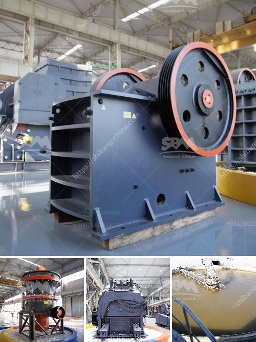

<h3>crusher for aggregate</h3>
In the construction industry, the demand for high-quality aggregate is ever-increasing. Aggregate is a crucial component used in making concrete, asphalt, and other construction materials. To meet this demand, the mining industry relies on crushing equipment to extract and process aggregates from natural deposits.

A crusher for aggregate is an essential tool for mining and quarrying operations. It is designed to reduce the size of large rocks, gravel, or sand into smaller, more manageable pieces. These machines are typically used at the primary stage of crushing to produce coarse and medium-sized aggregate for construction purposes.

One of the primary types of crushers used for aggregate production is the jaw crusher. Jaw crushers are popular due to their flexibility, efficiency, and reliability. They work by compressing the material between two plates, known as jaws, until it breaks into smaller pieces. This type of crusher is ideal for a variety of applications, such as limestone, granite, or concrete.

Another commonly used crusher for aggregate is the impact crusher. Unlike the jaw crusher, the impact crusher uses impact force to break down the material. It utilizes high-speed rotating rotors to generate the necessary energy for crushing. Impact crushers are particularly suitable for producing cubic-shaped aggregate and are often used in secondary or tertiary crushing stages.

The cone crusher is also an essential tool for aggregate production. It operates similarly to the gyratory crusher, with a spinning cone-shaped head that crushes the material against the walls of the crushing chamber. Cone crushers are popular for their versatility in processing different types of aggregate, including sand, gravel, and hard rock.

In conclusion, a crusher for aggregate is a vital machine in the mining industry for producing high-quality construction materials. Whether it's a jaw crusher, impact crusher, or cone crusher, these machines play a crucial role in the entire production process. By breaking down large rocks into smaller, more manageable pieces, crushers enable miners to extract valuable aggregates and create materials that are essential for the construction industry.
<h3>Contact us</h3><ul><li><strong>Whatsapp:&nbsp;<a href="https://wa.me/8613661969651">+8613661969651</a></strong></li><li><a href="https://swt.shibang-china.com/?git&amp;zhl&amp;crusher for aggregate"><strong>Online Service(chat now)</strong></a></li></ul><h3>Related</h3><ul><li><a href='lime production line price.md'>lime production line price</a></li><li><a href='iron ore beneficiation process in mexico.md'>iron ore beneficiation process in mexico</a></li><li><a href='grinding mill prices in zimbabwe.md'>grinding mill prices in zimbabwe</a></li><li><a href='slag crushing machine hopper in india.md'>slag crushing machine hopper in india</a></li><li><a href='cone crusher factory south africa.md'>cone crusher factory south africa</a></li></ul>