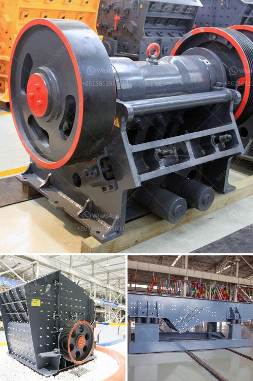

<h3>crusher for crushing limestone</h3>
Crushing limestone rocks is an integral part of construction projects and mining endeavors. This is because limestone is a sedimentary rock that is composed primarily of calcium carbonate, containing shells, fossils, and other geological resources. Understanding the process of crushing limestone rocks is critical for contractors and miners alike.

One of the key pieces of equipment used in limestone crushing is the crusher machine. Crushing consists of different stages involving primary, secondary and tertiary crushing. Limestone crushers reduce larger rocks or ore by means of compression. Mechanical pressure is applied using the crusher's two jaws; one is fixed while the other reciprocates.

There are also primary and secondary types of these crushers. Jaw crushers are one of the most commonly preferred crushers due to their ability to crush all kinds of materials of any hardness, as well as their low-cost operation and easy maintenance.

The primary impact crusher, on the other hand, offers high capacity and is designed to crush soft and medium-hard materials such as limestone and gypsum. With its adjustable curtains, it is a versatile crusher that allows operators to produce different sizes of end products.

When considering the crusher for limestone crushing, primary great importance is given to the crusher's productivity, mobility, and versatility. When directly fed from a crushing plant, the crusher's large feed opening provides excellent capacity and high reduction ratio, further ensuring a consistent product size. The hydraulic drive ensures trouble-free operation and enables the crusher direction to be changed in case of blockages.

In addition to reducing limestone rocks, crushers also have a wide range of applications in the aggregates and mining industries. These include but are not limited to crushing ores, extracting minerals, and producing recycled concrete. Crushers are essential for processing materials used in construction, such as gravel, sand, asphalt, and concrete.

Moreover, crushers play a crucial role in the recycling industry by turning demolished materials into usable products and preventing waste. The efficient and reliable operation of crushers is key to optimizing resources and minimizing environmental impact.

To conclude, the crusher is an essential piece of equipment for the effective crushing of limestone rocks. It offers versatility, high productivity, and reduced operational costs across various applications in the construction and mining industries. By understanding the process of crushing limestone, contractors and miners can choose the right crusher to optimize their operations and achieve their desired outcomes. Whether it's for building sturdy structures or extracting valuable minerals, crushers ensure efficient and sustainable production.
<h3>Contact us</h3><ul><li><strong>Whatsapp:&nbsp;<a href="https://wa.me/8613661969651">+8613661969651</a></strong></li><li><a href="https://swt.shibang-china.com/?git&amp;zhl&amp;crusher for crushing limestone"><strong>Online Service(chat now)</strong></a></li></ul><h3>Related</h3><ul><li><a href='hammer mill mining.md'>hammer mill mining</a></li><li><a href='iron crushing machine for sale.md'>iron crushing machine for sale</a></li><li><a href='roller mill manufacturer.md'>roller mill manufacturer</a></li><li><a href='how much would it cost to start a gravel quarry.md'>how much would it cost to start a gravel quarry</a></li><li><a href='crusher in sale in nepal.md'>crusher in sale in nepal</a></li></ul>