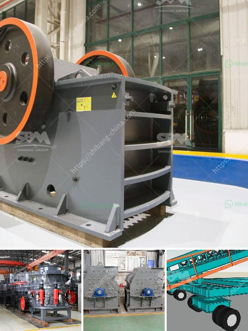

<h3>crusher for quarry</h3>
A crusher is a machine that breaks down large rocks into smaller pieces for easy disposal or further processing in a quarry. One of the most prevalent crushers in the mining industry is a jaw crusher which is often used in quarries due to its ability to crush tough and abrasive materials.

The functioning of a quarry crusher is relatively simple. The operator feeds the rocks into the crusher's hopper, where they are engaged by a series of jaws that crush them into smaller sizes. The crushed material then exits the crusher through a discharge opening, transforming it into a more manageable and transportable form.

Quarry crushers are crucial equipment in the mining industry as they serve as the initial stage of material reduction before further processing. They are essential for the production of construction materials such as concrete, asphalt, and aggregates. These materials are in high demand for infrastructure development, making quarry crushers an indispensable asset.

Apart from jaw crushers, there are other types of equipment commonly used in quarries. These include cone crushers, impact crushers, and gyratory crushers. Each type has its own unique features and advantages, tailored to specific requirements of quarry operations.

Advancements in technology have significantly improved the efficiency and performance of crushers in quarry settings. Modern crushers are equipped with advanced hydraulic systems, allowing for quick and easy adjustments to alter the size of the output material. The automation of these machines also ensures smoother and safer operation, minimizing downtime and enhancing productivity.

In conclusion, crushers have greatly contributed to the success of the mining industry, specifically in the quarry sector. These machines play a vital role in breaking down large rocks into smaller, more manageable sizes, allowing for efficient processing and utilization of valuable resources. Their continued development and improvement make them an essential tool in any quarry operation.
<h3>Contact us</h3><ul><li><strong>Whatsapp:&nbsp;<a href="https://wa.me/8613661969651">+8613661969651</a></strong></li><li><a href="https://swt.shibang-china.com/?git&amp;zhl&amp;crusher for quarry"><strong>Online Service(chat now)</strong></a></li></ul><h3>Related</h3><ul><li><a href='roks vertical mill.md'>roks vertical mill</a></li><li><a href='to buy medium mounted stone crusher in uk.md'>to buy medium mounted stone crusher in uk</a></li><li><a href='silica sand grinding machine.md'>silica sand grinding machine</a></li><li><a href='jaw crusher tanzania.md'>jaw crusher tanzania</a></li><li><a href='smallest gold crushing and washing plant.md'>smallest gold crushing and washing plant</a></li></ul>