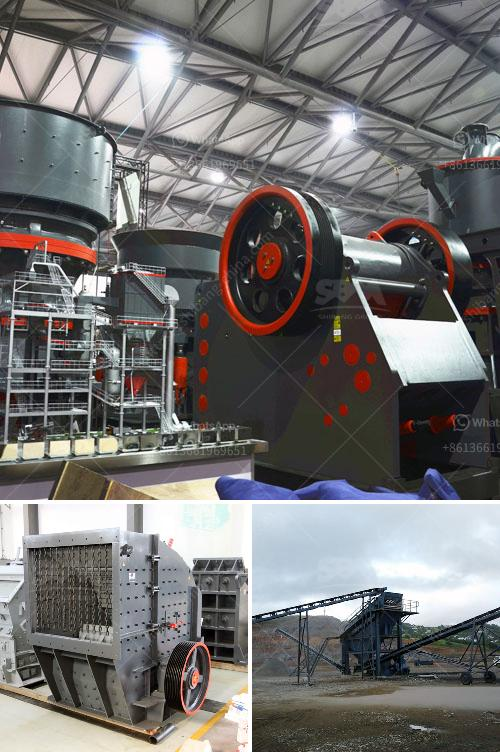

<h3>crusher for sale 120 ton</h3>
When it comes to heavy-duty equipment used for crushing various materials, a crusher capable of handling high tonnage is essential. In this article, we focus on a crusher for sale that offers crushing capabilities of 120 tons. With its exceptional power and versatility, this crusher is a perfect choice for industries that require reliable and efficient crushing operations.

With a crusher boasting a crushing capacity of 120 tons, various materials can be efficiently processed. The robust design and high-quality components ensure it can handle different types of aggregates, ores, minerals, and even recycled materials. Whether it's limestone, granite, basalt, or concrete, this crusher is versatile enough to crush them all, making it an ideal choice for construction, mining, quarrying, and recycling applications.

The 120-ton crusher packs a punch when it comes to crushing performance. Equipped with a powerful motor, it delivers exceptional crushing force that efficiently breaks down even the toughest materials. This ensures consistent output sizes, whether it is for road construction, building foundations, or industrial manufacturing. The advanced crushing mechanism and adjustable settings allow for precise control, enabling operators to achieve the desired product outputs with ease.

The crusher's high tonnage capacity translates into improved efficiency and productivity. With its ability to process large volumes of material in a single pass, time and energy are saved, increasing overall production output. Additionally, the crusher is designed to minimize downtime, featuring easy-to-access components, which simplifies maintenance and reduces repair time. As a result, operators can maximize uptime and keep their operations running smoothly, ensuring customer demands are met efficiently.

In today's world, environmental responsibility is crucial. The 120-ton crusher offers advanced features that contribute to sustainability efforts. It is equipped with modern technologies to reduce dust and noise emissions, minimizing the impact on the surrounding environment. Furthermore, the crusher's energy-efficient motor helps reduce energy consumption, optimizing energy usage and reducing operational costs. By opting for this crusher, companies can demonstrate their commitment to environmental conservation while benefiting from its powerful crushing capabilities.

If your business requires a reliable and high-capacity crusher, a 120-ton crusher for sale is an excellent investment. Its versatility, powerful crushing performance, improved efficiency, and environmental benefits make it a valuable asset in various industries.
<h3>Contact us</h3><ul><li><strong>Whatsapp:&nbsp;<a href="https://wa.me/8613661969651">+8613661969651</a></strong></li><li><a href="https://swt.shibang-china.com/?git&amp;zhl&amp;crusher for sale 120 ton"><strong>Online Service(chat now)</strong></a></li></ul><h3>Related</h3><ul><li><a href='diamond and gold washing plant.md'>diamond and gold washing plant</a></li><li><a href='gold refinery in philippines south africa.md'>gold refinery in philippines south africa</a></li><li><a href='japan crushing machine manufacturers list.md'>japan crushing machine manufacturers list</a></li><li><a href='stone crusher made in greece.md'>stone crusher made in greece</a></li><li><a href='chrome washing plant in south africa.md'>chrome washing plant in south africa</a></li></ul>