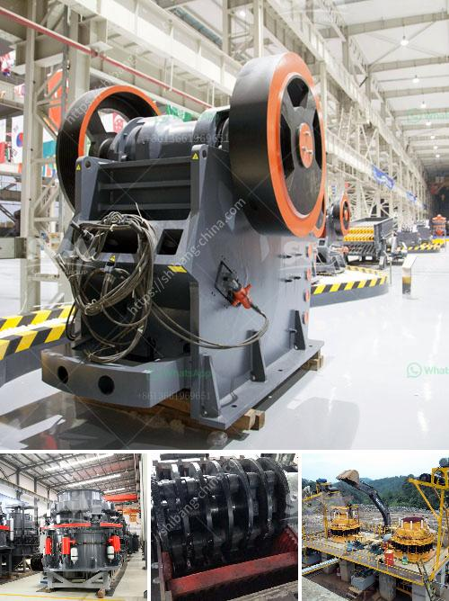

<h3>crusher for sale in dubai</h3>
Crusher machines play an important role in the stone crushing industry in Dubai. The materials processed by these machines are various, such as limestone, granite, basalt, gabbro, and river stone, etc.

Due to the economic development, the industry's demand for crushers is increasing rapidly, so the market for crushers is expanding sharply. As a leading manufacturer of crushers in Dubai, we are devoted to providing customers with high-quality machines to meet their requirements.

Our crushers for sale in Dubai listed below are mobile jaw crusher, mobile impact crusher, mobile cone crusher, all of which are designed to be easy operated and well maintained. They are manufactured with high-quality components by our in-house technicians, ensuring their durability and reliability.

The mobile jaw crusher, also called crawler-type jaw crusher, tracked jaw crusher, or pedrail jaw crusher, is designed for high performance in quarrying tasks, such as scaling large rock faces. The mobile cone crusher is a versatile machine that can be used in both hard rock and recycling applications. It features a powerful cone crusher that is efficient and reliable. The mobile impact crusher depends on hydraulic systems for use during construction projects to crush rocks directly into end products.

Our crushers have numerous integrated benefits that make them the perfect solution for any crushing application. Some of these benefits include:

1. Versatility: Our crushers are versatile machines that can handle various types of materials, including all types of ores, minerals, rock, construction waste, and more. They are suitable for both primary and secondary crushing.

2. Mobility: All machines are designed to be mobile, allowing them to easily move around job sites. This mobility ensures that operators can easily transport the machines to different locations, promoting efficiency and productivity.

3. Easy maintenance: We understand that maintenance is crucial to extending the lifespan of a crusher. Therefore, our machines are designed to be easily serviced and maintained. With our comprehensive support and maintenance services, customers can have peace of mind that their machines will remain in great condition.

4. High productivity: Our crushers are engineered with high productivity in mind. They are designed to deliver high capacity, superior reduction ratios, and excellent particle shape. This enhances the efficiency of any crushing operation.

5. Environmentally friendly: Our machines are designed to minimize environmental impact. They are equipped with advanced dust suppression systems that help mitigate dust emissions during operation. Additionally, they are built using eco-friendly materials and comply with all environmental regulations.

In conclusion, crushers for sale in Dubai are essential for stone crushing companies to ensure efficient production of aggregate materials. They have unique features that benefit the construction industry in terms of productivity and efficiency. We provide a wide range of crushers for sale in Dubai, whether you are looking for a mobile jaw crusher, mobile impact crusher, or mobile cone crusher, we have got you covered.
<h3>Contact us</h3><ul><li><strong>Whatsapp:&nbsp;<a href="https://wa.me/8613661969651">+8613661969651</a></strong></li><li><a href="https://swt.shibang-china.com/?git&amp;zhl&amp;crusher for sale in dubai"><strong>Online Service(chat now)</strong></a></li></ul><h3>Related</h3><ul><li><a href='small scale miners tonnes hour crushing machines.md'>small scale miners tonnes hour crushing machines</a></li><li><a href='marble crusher machinery manufacturer.md'>marble crusher machinery manufacturer</a></li><li><a href='mobile crushing station.md'>mobile crushing station</a></li><li><a href='river stone crushing machine.md'>river stone crushing machine</a></li><li><a href='price pe 600 and 900 stone crusher.md'>price pe 600 and 900 stone crusher</a></li></ul>