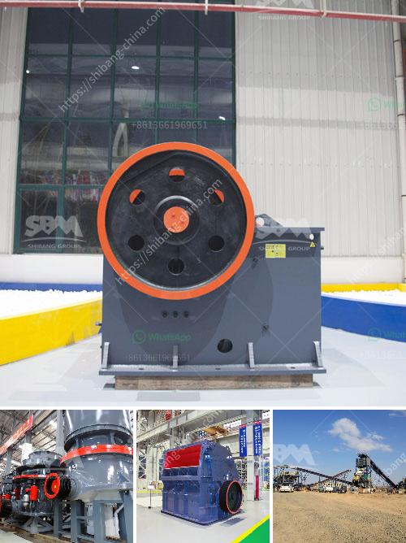

<h3>crusher hammer material grade</h3>
When it comes to selecting a suitable crusher hammer material for the construction of a crushing machine, the materials' grade plays a significant role. The chosen material should have sufficient strength and durability to withstand the wear and tear caused by the continuous crushing of various materials.

One popular material grade for crusher hammers is the medium carbon steel grade. This type of steel offers excellent strength and hardness, making it ideal for heavy-duty applications. The medium carbon steel grade provides a balance between toughness and wear resistance, ensuring that the hammers can withstand the impact of the materials being crushed without easily deforming or breaking.

Another material grade commonly used for crusher hammers is high manganese steel. This material offers exceptional wear resistance, making it suitable for crushing abrasive and hard materials. High manganese steel hammers have high toughness, allowing them to absorb the impact energy during the crushing process without fracturing.

For applications where impact resistance is crucial, alloy steel hammers are often preferred. These hammers are made from a combination of iron and other elements, such as chromium, molybdenum, or nickel, to enhance their strength and toughness. Alloy steel hammers have excellent impact resistance, which is essential for crushing harder materials or when the crusher is subjected to heavy impact forces.

In addition to the material grade, the heat treatment process applied to the crusher hammers also affects their performance. Proper heat treatment helps improve the hardness and strength of the hammers, ensuring they can withstand the demanding operating conditions. Common heat treatment methods include quenching and tempering, which enhance the durability and wear resistance of the hammers.

In conclusion, selecting the appropriate material grade for crusher hammers is crucial for ensuring the longevity and efficiency of a crushing machine. The medium carbon steel grade offers a good balance between strength and wear resistance, while high manganese steel provides exceptional wear resistance. For applications requiring high impact resistance, alloy steel hammers are the preferred choice. Along with the material grade, proper heat treatment also plays a vital role in enhancing the hammers' performance and durability.
<h3>Contact us</h3><ul><li><strong>Whatsapp:&nbsp;<a href="https://wa.me/8613661969651">+8613661969651</a></strong></li><li><a href="https://swt.shibang-china.com/?git&amp;zhl&amp;crusher hammer material grade"><strong>Online Service(chat now)</strong></a></li></ul><h3>Related</h3><ul><li><a href='used basalt stone jaw crusher for sale.md'>used basalt stone jaw crusher for sale</a></li><li><a href='stone crusher plates in south africa.md'>stone crusher plates in south africa</a></li><li><a href='fly ash introduction in cement ball mill.md'>fly ash introduction in cement ball mill</a></li><li><a href='aggregate machine traders.md'>aggregate machine traders</a></li><li><a href='copper oxide concentrate processing machines.md'>copper oxide concentrate processing machines</a></li></ul>