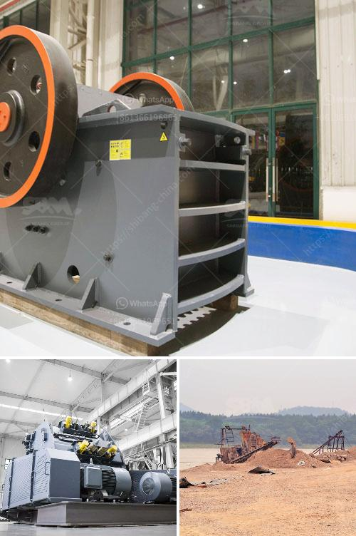

<h3>crusher in sale in nepal</h3>
Nepal has seen rapid urbanization in recent years, which has led to the growth of the construction industry. This has further boosted the demand for products like concrete, cement, and aggregates. To cater to this increasing demand, most businesses involved in construction projects are now investing in crushers - equipment that can effectively crush rocks, concrete, and other materials into smaller pieces.

A crusher is an essential piece of machinery that optimizes the process of breaking down large rocks, concrete, or stones into more manageable sizes for further use. Crushers play a significant role in the construction industry as they simplify the process of producing materials like basalt, gravel, and sand, which are essential for various construction projects such as building roads, bridges, and houses.

In Nepal, the use of crushers has become a significant trend as it brings numerous benefits to the construction industry. Firstly, crushers offer high efficiency by crushing rocks and other materials to the desired sizes required for construction purposes. The crushed materials can be directly used for various construction applications, eliminating the need for additional processing.

Secondly, crushers also have a positive environmental impact. By using crushers on-site, construction companies reduce the need to transport materials from quarries to the project site. This not only saves time but also reduces the carbon footprint associated with transportation. Additionally, having crushers on-site reduces the dust and noise pollution caused by transportation vehicles.

Moreover, crushers in Nepal are available in various types, which allow businesses to choose the most suitable one for their specific needs. Jaw crushers, cone crushers, and impact crushers are the most common types of crushers in the market. Jaw crushers are particularly useful for primary crushing applications, while cone crushers are ideal for secondary and tertiary crushing. On the other hand, impact crushers are widely used for crushing stones and rocks with high hardness.

The purchase of crushers in Nepal has become easier with numerous suppliers and manufacturers in the market. Construction businesses can find a wide range of crushers for sale, both new and used. It is essential to choose a reliable supplier to ensure high-quality equipment that will serve for a long time. Additionally, it is advisable to consider after-sales services and warranty options provided by the supplier.

Although crushers offer numerous benefits, it is crucial to adhere to safety measures while operating them. Proper training and guidance in the operation of crushers are necessary to prevent accidents and ensure worker safety. Employers must prioritize the safety of their workers by providing appropriate personal protective equipment and regularly inspecting the machinery for any malfunctions.

In conclusion, the sale of crushers in Nepal has witnessed a significant increase due to the booming construction industry. These machines have become essential in achieving efficient construction processes and producing the necessary materials for infrastructure development. With a wide variety of crushers available in the market, businesses can choose the most suitable one based on their specific requirements. However, it is crucial to prioritize safety and consider the reliability of suppliers before making a purchase.
<h3>Contact us</h3><ul><li><strong>Whatsapp:&nbsp;<a href="https://wa.me/8613661969651">+8613661969651</a></strong></li><li><a href="https://swt.shibang-china.com/?git&amp;zhl&amp;crusher in sale in nepal"><strong>Online Service(chat now)</strong></a></li></ul><h3>Related</h3><ul><li><a href='portable jaw crushers.md'>portable jaw crushers</a></li><li><a href='crusher machine cost.md'>crusher machine cost</a></li><li><a href='cost of graphite processing plant.md'>cost of graphite processing plant</a></li><li><a href='talc commodity processing facility companies.md'>talc commodity processing facility companies</a></li><li><a href='jaw crushers for sale south africa.md'>jaw crushers for sale south africa</a></li></ul>