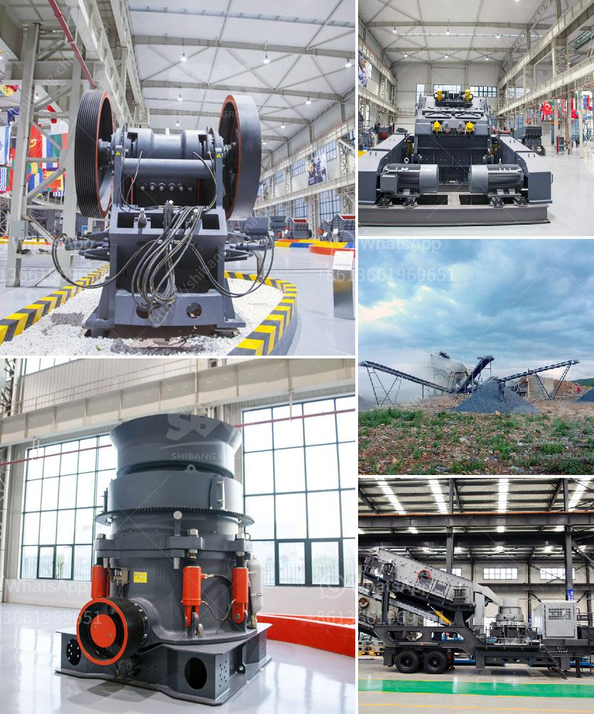

<h3>crusher in sri lanka</h3>
Sri Lanka, a beautiful island nation located in South Asia, boasts an impressive heritage, diverse culture, and breathtaking natural beauty. Amidst the thriving tourism industry and booming economy, the infrastructure development of the country has gained significant attention over the years. One key element in this development journey is the crusher industry, which plays a crucial role in the construction field of Sri Lanka.

A crusher, commonly known as a stone crusher, is an essential piece of machinery that reduces the size of stones and rocks into small, manageable pieces. This machinery is widely used in the construction industry, mining industry, and even in the production of cement. Crushers are typically heavy-duty machines that are operated by professional technicians.

In recent years, the crusher industry in Sri Lanka has witnessed tremendous growth due to the increasing demand for construction materials. Infrastructure projects, such as road constructions, housing projects, and commercial constructions, have significantly contributed to this surge in demand. Subsequently, crusher businesses have flourished, providing equipment and services to meet these construction needs.

The crusher industry in Sri Lanka has not only stimulated economic growth but has also played a vital role in employment generation. Large-scale crusher companies employ a significant number of skilled laborers, machine operators, and technical staff, contributing to overall economic prosperity. Additionally, it has created opportunities for small-scale entrepreneurs who engage in renting or leasing crushers to contractors and construction companies.

Furthermore, crushers have been proven to be cost-effective in the construction process, enabling sustainable development. By recycling and reusing materials, crushers reduce the need for new aggregates, thereby conserving natural resources. This reduction in consumption of raw materials not only benefits the environment but also contributes to the goal of achieving sustainable development.

However, like any other industry, the crusher industry in Sri Lanka has its set of challenges. Environmental concerns, particularly dust and noise pollution, need to be addressed to minimize the impact on nearby communities. The government and crusher businesses are urged to implement appropriate measures to mitigate these challenges through regular maintenance, dust suppression techniques, and noise reduction strategies.

In conclusion, the crusher industry in Sri Lanka has become an indispensable part of the construction sector, enhancing infrastructure development and economic growth. As we continue on this path towards progress, it is crucial to ensure sustainable practices are implemented to minimize environmental impacts while maximizing the benefits of this essential industry.
<h3>Contact us</h3><ul><li><strong>Whatsapp:&nbsp;<a href="https://wa.me/8613661969651">+8613661969651</a></strong></li><li><a href="https://swt.shibang-china.com/?git&amp;zhl&amp;crusher in sri lanka"><strong>Online Service(chat now)</strong></a></li></ul><h3>Related</h3><ul><li><a href='river stone crushing plant for sale.md'>river stone crushing plant for sale</a></li><li><a href='materials used to make a talcum powder.md'>materials used to make a talcum powder</a></li><li><a href='sample busines project proposal for stone crusher.md'>sample busines project proposal for stone crusher</a></li><li><a href='diamond dms plant for sale south africa.md'>diamond dms plant for sale south africa</a></li><li><a href='mtm trapezium grinder mill.md'>mtm trapezium grinder mill</a></li></ul>