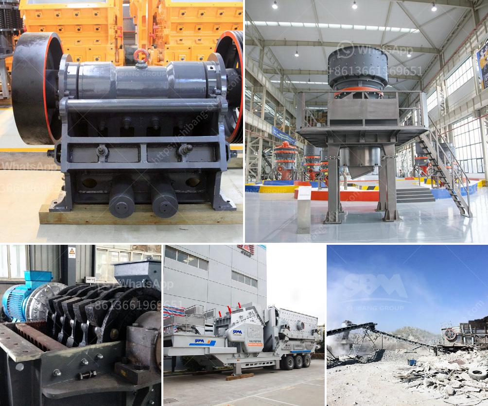

<h3>crusher machine 200 ton per hours</h3>
The utilization of crusher machine 200 ton per hours has gained widespread popularity as an essential equipment in construction, mining, quarrying, and road-building industries. The rapid industrialization globally has led to an increased demand for this machinery, resulting in a significant boom in the market.

The crusher machine is an indispensable piece of equipment for crushing stones and minerals. Its ability to produce finely crushed aggregates enables it to be used prominently in construction projects. With the increasing need for high-quality aggregates, the demand for crusher machines is also rising.

One of the key factors contributing to the popularity of crusher machines is their efficiency in crushing large quantities of materials. With a capacity of 200 tons per hour, these machines offer a high level of performance. Their high-speed mechanism enables them to efficiently process large volumes of raw materials, reducing the need for manual labor and saving time.

Crusher machines are designed to handle various types of materials, including rocks, gravel, limestone, concrete, and asphalt. They can be utilized in a multitude of applications such as road construction, building construction, mining operations, and recycling. The versatility of this equipment allows it to be used in different industries with varied requirements.

The impact crusher is one of the most commonly used crusher machines. It uses impact force to crush materials and is often used to produce finely crushed aggregates. The jaw crusher, on the other hand, utilizes compression force to crush stones, providing a precise and consistent end product.

In addition to their efficiency and versatility, crusher machines also offer easy operation and maintenance. Their robust construction and user-friendly interface make them accessible to operators of all skill levels. Routine maintenance and regular inspections are essential to ensure their optimal performance and longevity.

Investing in a crusher machine with a 200-ton-per-hour capacity can significantly enhance productivity while reducing the overall cost of production. However, it is crucial to consider various factors before making a purchase. Assessing the specific requirements of the project, the type and size of materials to be crushed, and the available budget are essential aspects to consider.

It is also worth considering the environmental impact of crusher machines. Many manufacturers are developing advanced technologies to reduce energy consumption, minimize emissions, and incorporate sustainable features. Choosing an environmentally friendly crusher machine can contribute to the overall sustainability of the project.

In conclusion, crusher machines are valuable equipment in various industries due to their ability to efficiently crush large volumes of raw materials. With a capacity of 200 tons per hour, these machines offer a high level of performance and productivity. Their versatility, ease of operation, and maintenance make them an indispensable asset in construction, mining, quarrying, and road-building industries. Consideration of specific project requirements, environmental impacts, and budget constraints is crucial when investing in a crusher machine. With proper maintenance and adherence to safety regulations, these machines can provide reliable performance for years to come.
<h3>Contact us</h3><ul><li><strong>Whatsapp:&nbsp;<a href="https://wa.me/8613661969651">+8613661969651</a></strong></li><li><a href="https://swt.shibang-china.com/?git&amp;zhl&amp;crusher machine 200 ton per hours"><strong>Online Service(chat now)</strong></a></li></ul><h3>Related</h3><ul><li><a href='chrome concentrate wash plant for sale.md'>chrome concentrate wash plant for sale</a></li><li><a href='ball mill for sale cagayan.md'>ball mill for sale cagayan</a></li><li><a href='gold processing plant for sale.md'>gold processing plant for sale</a></li><li><a href='river stone crushing plant for sale.md'>river stone crushing plant for sale</a></li><li><a href='catalog of stone crusher production line made in iran.md'>catalog of stone crusher production line made in iran</a></li></ul>