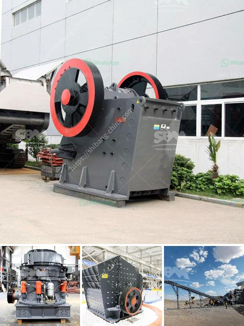

<h3>crusher machine company</h3>
In today's fast-paced urbanization and industrialization, there is a dire need for machinery that simplifies heavy tasks and makes our lives easier. One such machine that has revolutionized the world of crushing is the crusher machine. This device has made a tremendous impact across various industries, enabling the efficient extraction, processing, and utilization of materials.

One prominent player in this realm is Crusher Machine Company (CMC). Established in the early 2000s, CMC has quickly emerged as a leading manufacturer and supplier of high-quality crushing machines. With a strong focus on research and development, CMC relentlessly strives to enhance its technology and design to meet the evolving needs of its customers.

The crushers produced by CMC are not only robust but also immensely versatile. They are engineered to handle an extensive range of materials, including ores, minerals, rocks, construction waste, and more. This broad adaptability has made CMC's machines indispensable in numerous industries such as mining, construction, recycling, and quarrying.

One of the key strengths of CMC lies in its commitment to innovation and constant improvement. The company invests heavily in research and development to come up with cutting-edge technologies. By harnessing the power of automation, intelligent control systems, and superior engineering, CMC's crushers have achieved unparalleled efficiency and performance. For instance, their crushers are equipped with advanced hydraulic systems, enabling operators to adjust the discharge setting quickly, thereby optimizing the production output.

Another notable aspect of CMC is its dedication to providing customized solutions. Recognizing that every customer has specific requirements, the company offers tailor-made crushers that cater to individual needs. This customer-centric approach has garnered CMC a loyal clientele across the globe, who rely on the company's expertise to deliver machines that ensure maximum productivity and profitability.

CMC's commitment to quality is evident in every product it manufactures. The company adheres to stringent quality control measures, ensuring that each crusher is manufactured to the highest standards. From the selection of materials to the assembly and testing processes, CMC's attention to detail guarantees uncompromising reliability and durability.

Besides the exceptional quality of its crushers, CMC also takes pride in its comprehensive after-sales support and services. The company is equipped with a team of experienced engineers and technicians who provide prompt assistance, installation guidance, and maintenance advice. This ensures that customers can operate their machines with utmost confidence, minimizing downtime and maximizing productivity.

As a responsible corporate entity, CMC acknowledges the impact of its operations on the environment. The company is committed to reducing its carbon footprint and employs eco-friendly manufacturing practices. Furthermore, CMC actively promotes the recycling of construction waste by manufacturing crushers specifically designed for this purpose. This sustainable approach reflects the company's commitment to creating a greener and more sustainable future.

In conclusion, Crusher Machine Company (CMC) has emerged as a game-changer in the crushing industry. Its innovative and versatile crushers, combined with a deep commitment to quality, customized solutions, and excellent after-sales support, have earned CMC a well-deserved reputation as a leader in this field. As industries continue to evolve, CMC remains at the forefront, constantly pushing boundaries to provide the most advanced and efficient solutions for crushing needs.
<h3>Contact us</h3><ul><li><strong>Whatsapp:&nbsp;<a href="https://wa.me/8613661969651">+8613661969651</a></strong></li><li><a href="https://swt.shibang-china.com/?git&amp;zhl&amp;crusher machine company"><strong>Online Service(chat now)</strong></a></li></ul><h3>Related</h3><ul><li><a href='calcite micron powder grinding machine in thailand.md'>calcite micron powder grinding machine in thailand</a></li><li><a href='roks vertical mill.md'>roks vertical mill</a></li><li><a href='clay grinding plant.md'>clay grinding plant</a></li><li><a href='stone crusher machine pakistan.md'>stone crusher machine pakistan</a></li><li><a href='small mobile wash plants for sale.md'>small mobile wash plants for sale</a></li></ul>