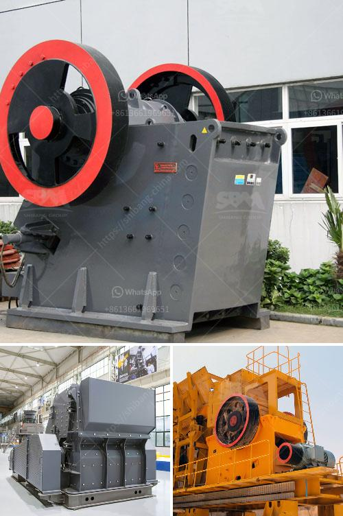

<h3>crusher machine cost</h3>
Crusher machines are essential equipment in mining and construction industries. In recent years, the demand for crushing machines has been increasing greatly due to the rapid growth of these industries. However, crusher machine cost is still a major concern for many businesses, as the cost can vary greatly depending on the manufacturer, brand, model, and capacity.

When it comes to crusher machines, there are two main types – stationary and mobile. Stationary machines are usually used in large mining or construction projects where a constant and uninterrupted supply of materials is required. These machines are more expensive compared to mobile ones, but they offer greater efficiency and productivity.

On the other hand, mobile crusher machines are gaining popularity due to their portability and flexibility. They can be easily transported to different locations, allowing businesses to crush materials on-site, eliminating the need for transportation costs. Mobile machines are usually cheaper compared to stationary ones, but their capacity might be limited.

Besides the type of crusher machine, the cost can also be influenced by factors such as the quality of materials used, the level of automation, and the after-sales service provided by the manufacturer. It is important to consider the long-term expenses associated with owning a crusher machine, including maintenance, repairs, and replacement of parts.

On average, a good quality crusher machine can cost anywhere between $100,000 to $300,000. The cost varies depending on the size, capacity, and features of the machine, as well as the location and supplier. It is crucial to compare different options and obtain quotes from multiple suppliers to get the best value for money.

In conclusion, the cost of a crusher machine can vary significantly depending on various factors. It is advisable for businesses to conduct thorough research and consider their specific needs before making a purchase. Comparing quotes from different suppliers and considering the long-term expenses are essential to ensure a cost-effective investment in a crusher machine.
<h3>Contact us</h3><ul><li><strong>Whatsapp:&nbsp;<a href="https://wa.me/8613661969651">+8613661969651</a></strong></li><li><a href="https://swt.shibang-china.com/?git&amp;zhl&amp;crusher machine cost"><strong>Online Service(chat now)</strong></a></li></ul><h3>Related</h3><ul><li><a href='specification for pe 250x400 jaw crusher.md'>specification for pe 250x400 jaw crusher</a></li><li><a href='iron ore processing plant design pdf.md'>iron ore processing plant design pdf</a></li><li><a href='mini cement plants manufacturer africa.md'>mini cement plants manufacturer africa</a></li><li><a href='quarry processing plant.md'>quarry processing plant</a></li><li><a href='kenya jaw crushers south africa.md'>kenya jaw crushers south africa</a></li></ul>